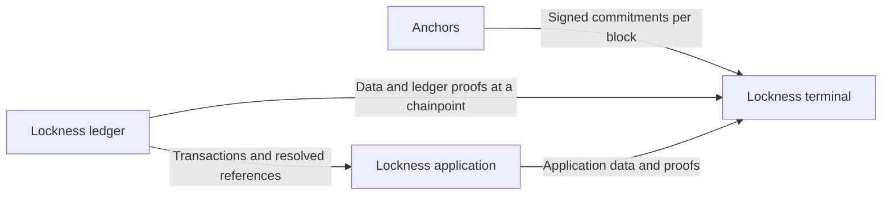

# Lockness

As an application developer, let terminals consume anchored data: verify the facts behind a transaction or real-world action without trusting the server that supplies them or running a chain follower for each application.

Lockness is the project-level architecture for independently published ledger commitments, chainpoint-bound data and witnesses, and optional application proof builders on Cardano.

**Status: design only.** This repository records the direction and unresolved contracts. It does not yet contain a ledger service, client verifier, formal model or simulator.

## Why terminals should consume anchored data

A server answer alone asks the terminal to accept the server's view of the ledger. Data accompanied by a proof lets the terminal check a stated claim against a root accepted from independent anchors, at a selected chainpoint. The data provider supplies the answer; the terminal chooses its trust policy and verifies the evidence before using that answer.

This makes data providers replaceable and proof construction delegable. A wallet can check the NFT state it uses to build a transaction; an external system can check a ledger fact before authorizing an effect. Applications share the cost of generic chain following while keeping their own interpretation and action policy.

Anchored data means data whose relevant claim has been verified against an accepted commitment. It does not mean every response must carry a proof: historical transaction CBOR may be reconstruction material, with the reconstructed state checked against an anchored application root. Proofs establish their stated claims; freshness, completeness and permission to act need their own contracts. See [the verification boundary](docs/architecture/system.md#why-data-should-travel-with-proofs).

## User stories

- A client selects a signed commitment from publishers it trusts and verifies evidence before building a transaction.
- A data provider serves data and witnesses at one selected chainpoint, or explicitly refuses an unavailable point.
- An application builder reconstructs state and generates application proofs without operating another chain follower.
- An independent publisher follows the ledger and publishes a signed commitment for every block without hosting historical query views.

**Ledger proofs concern on-chain validity in the present, at the selected chainpoint. Application proofs concern on-chain validation of a future proposed transaction.**

Ledger proofs are consumed off-chain by terminals. Application proofs are the proofs included in transaction redeemers. Cardano validates the transaction against its actual ledger state; application validators check the application proofs. Signed roots still belong to the independent anchor streams.

## Read the design

- [Architecture and chain-following responsibilities](docs/architecture/system.md)
- [Chainpoint sessions](docs/design/chainpoints.md)
- [Decisions and unresolved contracts](docs/design/decisions.md)
- [Delivery roadmap](docs/roadmap.md)
- [Project stories](docs/stories/index.md)

Read the published design at <https://lambdasistemi.github.io/lockness/>.

## Named components

- **`lockness-anchors`** run nodes and serve signed roots, one publication per block.
- **`lockness-ledgers`** run nodes and serve data and proofs at retained chainpoints.
- **`lockness-applications`** interpret ledger history and serve application proofs; they do not need their own chain follower.
- **`lockness-terminals`** consume roots, data and proofs, verify them, and build transactions or use verified facts to drive real-world effects.

Any number of anchors and ledgers may operate. Component names describe roles; separate component repositories have not been created. The four names describe roles; they do not prescribe how many deployments or repositories exist.

## Repository scope

This repository owns the project vision, contracts between components, design models and cross-repository acceptance. [cardano-utxo-csmt](https://github.com/lambdasistemi/cardano-utxo-csmt) is the existing candidate ledger engine. MPFS and Singular are consumers whose interpretation remains outside the generic ledger service.

The existing [internal-index epic](https://github.com/lambdasistemi/cardano-utxo-csmt/issues/240) and [HTTP epic](https://github.com/lambdasistemi/cardano-utxo-csmt/issues/246) predate this architecture and need reconciliation. Their shared-follower consumer and HTTP contracts are not the accepted implementation plan for Lockness.

## Check the documentation

Install Nix with flakes enabled, then run `./tools/check-docs.sh`. It checks presentation and speech companions and builds MkDocs in strict mode using the pinned shared documentation environment. `just ci` runs the same command when Just is installed.

Documentation checks establish only that the design record builds. They do not establish the correctness or delivery of the proposed system.

## License

Apache License 2.0. See [LICENSE](LICENSE).
