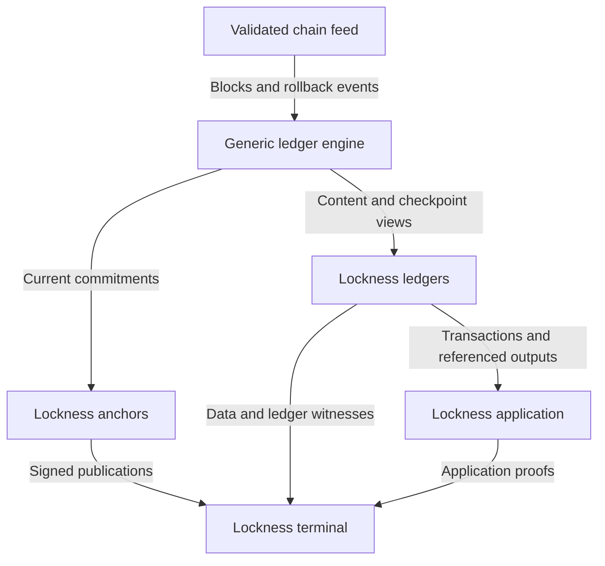
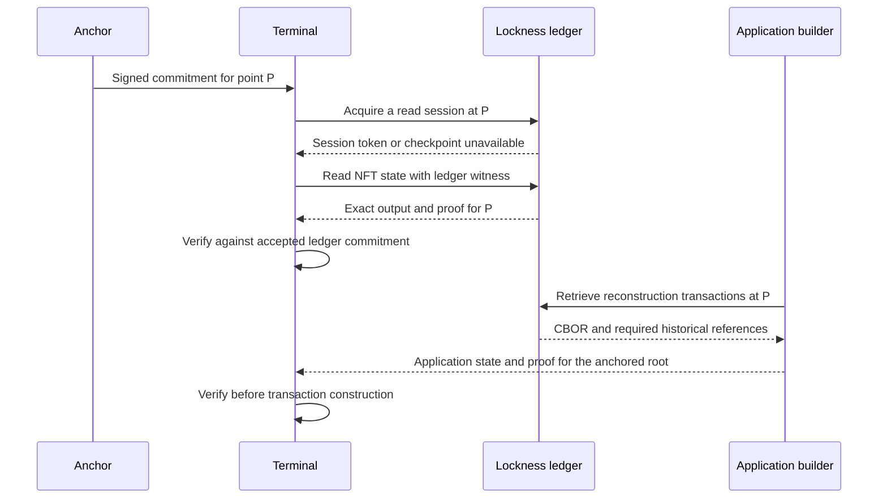

# Architecture and operating cost

As a project maintainer, invest chain-following infrastructure once in generic ledger capabilities, while adding applications through interpretation and proof construction.

## Components and chain following

| Component | Chain following | Responsibility |
| --- | --- | --- |
| `lockness-ledgers` | Runs nodes and follows the chain | Store ledger content, maintain authenticated indexes, handle rollback, retain query views and serve evidence. |
| `lockness-anchors` | Runs nodes and follows the chain | Compute commitments from a trusted validated feed and publish a signed commitment for every block. |
| `lockness-applications` | Not required | Retrieve relevant historical data, interpret it, reconstruct application state and generate proofs. |
| `lockness-terminals` | Not required | Consume and verify roots, data and proofs; build transactions or drive real-world effects from verified facts. |

Anchors and ledgers are plural because any number of independent instances may exist. Both roles run nodes. Anchors serve signed roots; ledgers serve data and proofs. They can reuse the generic commitment engine without sharing a running process. Independent publishers establish their own commitments. Signing an untrusted provider's supplied root does not create independent assurance. The cost and trust consequences of shared node infrastructure must be explicit.

A terminal is the consuming role, including wallets, applications and integrations with external systems. It verifies the roots, proofs and data it uses, then builds transactions or uses the verified facts to drive real-world effects. The authorization and execution of those effects are application policy, not an action performed by the generic ledger service.

## Data and trust are separate

A root publisher endorses a commitment for a network and chain point. A client owns the trusted keys and acceptance policy. A ledger provider and an application proof builder remain untrusted for correctness; valid evidence, rather than their identity, permits the client to use a result.

Signed messages need an unambiguous network, slot, block hash, commitment scheme/version and root identity. Publisher agreement rules, key rotation, freshness and branch correction are unresolved protocol contracts. A signature identifies an endorsement; it does not establish the correctness of the endorsed ledger.

## Proof composition

The two proof values have different temporal roles. **Ledger proofs concern on-chain validity in the present**, meaning the ledger state at the selected checkpoint. **Application proofs concern on-chain validation in the future**, when a proposed transaction executes.

| Proof value | What it establishes or supports | Where it is checked |
| --- | --- | --- |
| Ledger proof | A claim about the already established ledger state at the selected checkpoint: the present facts used for construction. | Off-chain, by the terminal against an accepted anchor commitment. |
| Application proof | Evidence for the application validator to check a proposed transition: future validation. | In the terminal before use, then on-chain from the transaction redeemer. |

“Present” is checkpoint-relative, not a promise that an old view remains the chain tip. “Future validation” describes the proof's role, not a guarantee that the submitted transaction succeeds after intervening state changes.

Application builders may generate proofs on behalf of clients. A client may instead reconstruct the tree locally. The application root comes from the verified state output; it is distinct from the ledger-index root. A reused proof must match the receiving context's claim, encoding and root. Valid evidence at an old checkpoint is not a promise that a future transaction will still be admissible.

**Transaction boundary:** ledger proofs remain off-chain and are not included in transaction redeemers. A terminal uses them to check the ledger data it builds from. Application-level proofs are included in redeemers and checked by the application validators against the on-chain application state. Cardano validates inputs, value conservation and the other applicable ledger rules against its actual state; it does not consume the terminal's CSMT witness as a substitute for those checks. Signed anchor-root publication remains separate from transaction submission.

Historical transactions may be untrusted reconstruction material. Matching the reconstructed tree to an authenticated root establishes the resulting committed state under the application's reconstruction rules; it does not automatically prove every asserted historical event or the completeness of arbitrary transaction-history queries.

## Service boundary

The generic service retains transaction CBOR and ledger references. It must understand enough ledger structure to index and follow the chain, but does not decide what a redeemer means for MPFS or Singular. Exact history coverage and spent/reference-input resolution remain to be specified. Application proof builders interpret datums, redeemers and other application-relevant transaction fields.

Not every response needs a proof. Each endpoint must state its claim and whether its payload is authenticated evidence or untrusted reconstruction material. Evidence-bearing responses may bundle data and proofs. Separate retrieval can remain possible, but Koios wire compatibility is not a requirement for the stronger checkpoint contract.

## Decisions

| Chosen direction | Alternative | Reason |
| --- | --- | --- |
| Generic chain-following engine reused across publisher and provider roles | A full chain indexer for every application | Keep infrastructure cost in reusable ledger capabilities. |
| Independent signed commitments plus verifying clients | Trust the data server's own advertised root | Separate data availability from authority. |
| Optional application proof builder | Require every client to reconstruct every proof | Permit delegation of computation without delegating correctness. |
| Preserve transaction CBOR and resolve required references | Select a small set of fields based on one application | Other applications may consume different transaction fields. |
