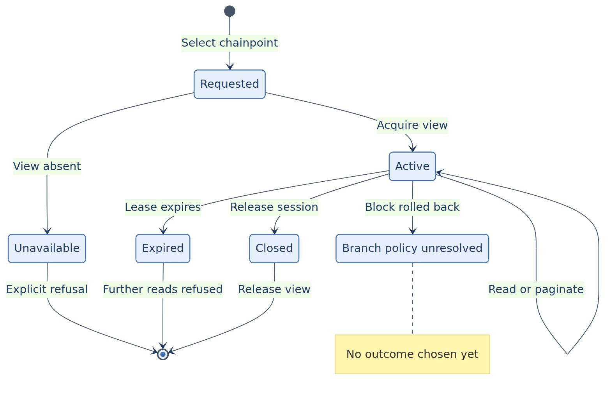
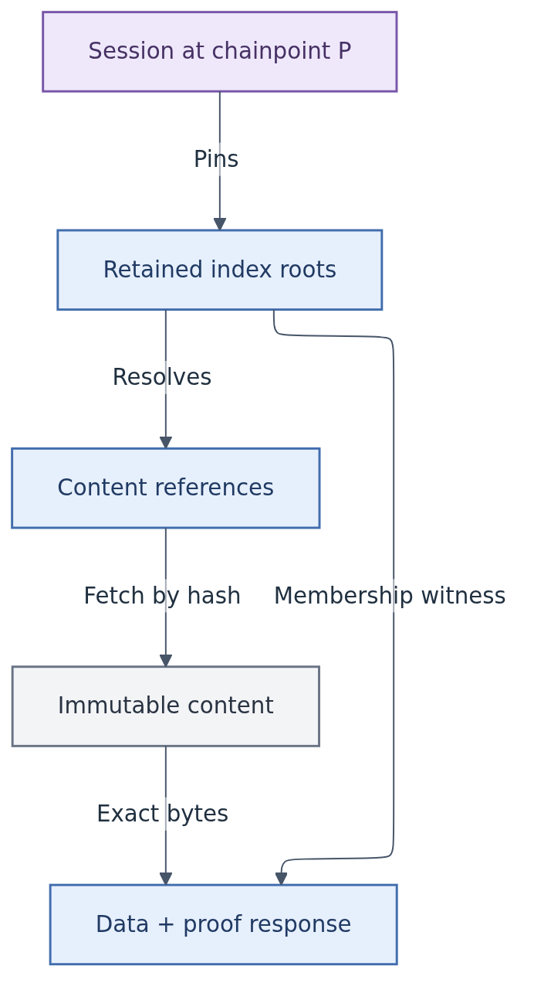

# Chainpoint sessions

As a client, make several dependent reads and paginate results from one selected ledger state, even while the provider follows new blocks. If that state cannot be served, receive a named refusal rather than a silently newer answer.

## Session contract

Use **chainpoint** throughout Lockness. This corresponds to Cardano API's [`ChainPoint`](https://cardano-api.cardano.intersectmbo.org/cardano-api/src/Cardano.Api.Block.html#ChainPoint): either genesis or a slot number paired with a block-header hash. The network is separate context and must also be bound by the protocol. A slot number alone does not identify a chainpoint across competing branches.

A session token binds reads to the network, selected chainpoint and a retained view; it is not a source of trust. A chainpoint names a chain position, a view exposes state at that position, and a session retains access under a lease. The client verifies results against its separately accepted commitment. Different providers may issue different tokens for the same chainpoint. Whether sessions can be acquired at genesis remains a service-contract decision.

<!-- diagram: session -->

<a href="../diagrams/session.png">Open full size</a> · <a href="../diagrams/session.mmd">Mermaid source</a>

Retention and lease limits are not yet fixed. The design must bound resource use without evicting an active view contrary to its advertised contract. A rollback does not turn a block hash into a different block; the policy for sessions on an abandoned branch remains open. No automatic chainpoint substitution is allowed.

## Storage separation

<!-- diagram: storage -->

<a href="../diagrams/storage.png">Open full size</a> · <a href="../diagrams/storage.mmd">Mermaid source</a>

Immutable content survives rollback. Chain-index membership and branch status determine which content belongs to the selected ledger state. Storing an object is not evidence that it is live or canonical.

Retained views may use persistent index nodes, shared snapshots, or an isolated overlay reconstructed using rollback information. The mechanism has not been chosen. A read-only RocksDB snapshot is not itself a writable rollback target. Storage growth, write amplification, historical-read latency and session concurrency require measurement before choosing an implementation.

## Decisions

| Chosen direction | Alternative | Reason |
| --- | --- | --- |
| Select a chainpoint before reading | Combine independently fetched latest responses | Avoid mixed chainpoints and trial-and-error matching. |
| Bounded retained views and sessions | Promise arbitrary historical views indefinitely | Make availability and storage commitments explicit. |
| Immutable content separate from chainpoint indexes | Roll payload storage backward for every query | Share content while restoring only references and commitments. |

## Open questions

- What happens to an active session after its selected block leaves the canonical chain?
- What retention and lease policy bounds storage and prevents resource exhaustion?
- Which roots and indexes are captured atomically in a view?
- How are chainpoint availability and publisher history discovered?
- Which history/reference queries are bounded by the point, and how is incomplete archive coverage reported?
- Which failures require retrying the same point, and which require explicit client selection of a new point?

The first formal design slice should model acquisition, reads, rollback, expiry and eviction before optimizing physical storage.
