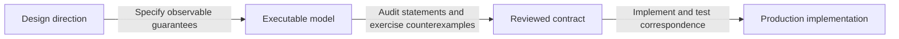

# Design direction and unresolved guarantees

As a contributor, distinguish the project's agreed direction from decisions still requiring a concrete contract and evidence.

## Recorded direction

The following direction was established in the project discussion on 3 October 2026. These are design inputs, not claims of implemented or formally verified behavior.

| Direction | Earlier alternative | Why it changed |
| --- | --- | --- |
| Work at project level in Lockness | Extend one repository's asset endpoint in isolation | Trust publication, retained views and client verification cross component boundaries. |
| Publishers emit signed commitments for every block | Publishers choose and retain client query sessions | Publication and data-serving availability are independent responsibilities. |
| Clients use a selected published checkpoint | Clients ask publishers to coordinate each query | Signed streams supply commitments independently of data retrieval. |
| Checkpoint-bound proof-bearing API | Duplicate Koios response shapes as the governing contract | Query compatibility alone does not establish coherent multi-query reads. |
| Serve complete transaction CBOR as reconstruction material | Define a smaller application-neutral transaction projection now | Sufficiency is application dependent; preserving information precedes optimization. |
| Optional application proof services | Either trust an application backend or do everything locally | Proof construction can be delegated and checked locally. |

## Named deployment roles

The project names the roles `lockness-anchors` and `lockness-ledgers`, plural because any number of instances is expected. Anchors run nodes and serve signed roots. Ledgers run nodes and serve data and proofs. The `lockness-applications` role serves application proofs using retrieved ledger history. The `lockness-terminals` role consumes roots, proofs and data, verifies them, and builds transactions or drives real-world effects from verified facts. These are component boundaries, not a command to create separate repositories now.

## Words that constrain the design

Selected project rulings, preserved verbatim:

> "we need to separate a hash to content append only DB containing the assets and chain cursors indexing them"

> "and trust providers, they will just publish them all. Every block will have one."

> "So now we don't have to serve data with the same shape of COYOS because I mean we have different guarantees and the approach of mpfs backent applies, every answer carries the data necessary to build proofs against an external provided root for the pinned chainpoint"

The later discussion refined the last statement: historical transactions can be untrusted reconstruction material, while claims used as authoritative ledger or application facts need verification. The precise endpoint claim inventory is still open.

Ledger and application proofs have distinct destinations: ledger witnesses are verified off-chain by terminals and are not carried into transactions. Application proofs are carried in redeemers and checked by application validators. Cardano enforces transaction validity against its own ledger state. This distinction does not stop anchors publishing signed roots.

The temporal distinction is an explicit project ruling:

> "the ledger proofs are about on-chain validity (present), application proofs are about on-chain validation (future)"

Here the present is the selected checkpoint. An application proof is intended for checking a proposed transition on-chain; its availability is not a promise of future transaction acceptance.

## What remains unproved

- The full commitment inventory: live UTxOs, asset sets and any historical indexes need separately stated proof guarantees.
- Completeness and absence require explicit proof contracts; inclusion proofs alone do not establish a full result set.
- Archive coverage and referenced-output retrieval must be sufficient for a real application's replay, not merely a selected transaction sample.
- Publisher policy, key rotation, signed message encodings, freshness and rollback notices remain unspecified.
- Active-session behavior on fork abandonment and bounded retention remain unresolved.
- Application replay and proof checks need to bind NFT identity, exact datum, root and selected state without accepting a different application or checkpoint.

## Evidence available today

[MPFS's facts verifier](https://github.com/lambdasistemi/cardano-mpfs-offchain/blob/0f82465f5f828c2ab987a166e9e24c2368228d01/cardano-mpfs-verify/lib/Cardano/MPFS/Client/Verify/Read.hs) already anchors a state output and checks the root reconstructed from returned facts. It is useful prior implementation, not evidence that the proposed transaction-retrieval architecture is delivered.

The inspected [Koios asset query](https://github.com/cardano-community/koios-artifacts/blob/2e2eb57933e1e2528de5ca36ee961759841cf389/files/grest/rpc/assets/asset_utxos.sql) and [Blockfrost API](https://github.com/blockfrost/openapi/blob/05c6d61311f2d4d5c701d029ba702be86d36da69/openapi.json) do not expose the required shared chain-point session contract for the relevant UTxO queries. This is a finding about those published interfaces, not their internal database capabilities.

[CSMT root-signing work](https://github.com/lambdasistemi/cardano-utxo-csmt/pull/231) is related work. Its existence does not establish an accepted publisher-stream protocol.
