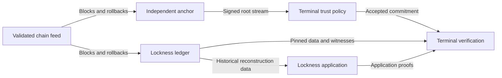

# Lockness

As an application developer, obtain ledger facts and application proofs from replaceable providers, verify them against independently trusted commitments, and build transactions without maintaining your own chain follower.

## User stories

Lockness separates who provides data from who endorses ledger commitments. A client selects a commitment at a chain point, obtains a read session for that point, and verifies the evidence it uses. Application-specific proof construction can happen locally or at an optional service.

## Current state

This is a design-stage project. The architecture direction is recorded; checkpoint behavior during rollback, authenticated history, proof formats and acceptance rules remain to be specified and tested. There is no production Lockness service or accepted formal model yet. No institution is claimed to operate a publisher.

Start with the [architecture](architecture/system.md), then the [checkpoint contract](design/checkpoints.md) and [delivery roadmap](roadmap.md).
