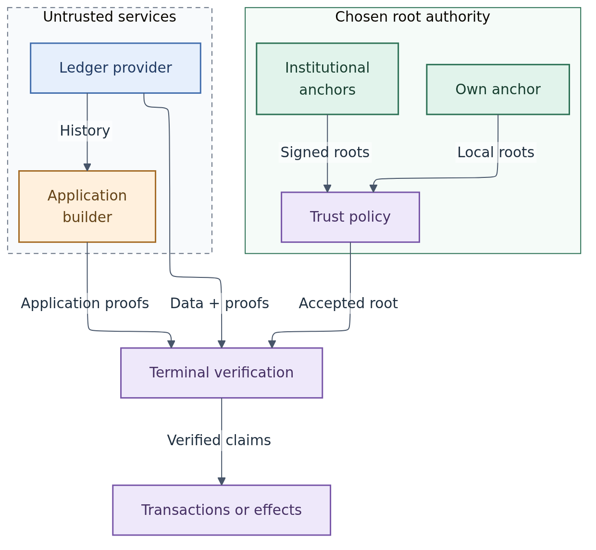

# Lockness

As an application developer, let terminals consume anchored data before building transactions or driving real-world effects, without maintaining a chain follower for each application.

## Web2 scaling with explicit trust management

Lockness lets applications buy data and computation from competing providers while terminals keep control over trust. Ordinary servers, caches and replicas supply capacity; independently accepted roots and proof verification establish the claims the terminal consumes.

**Run your own anchor for the optimal deal in trust independence.** Maintain your own validated chain and commitments, then buy the ledger service's historical storage, chainpoint views, queries and proof generation. Extensive offloading can preserve your own source of trust.

**Observe institutional publications for an exceptionally attractive operational deal.** Accept signed roots from institutions selected under your trust policy and avoid operating an anchor. The institutional trust is explicit; no participating institution or live publication service is claimed today.

Applications and providers negotiate availability: coverage, retention, throughput, latency and uptime. This separates a checkable answer from a commercial promise to deliver it. The goal is efficient market-driven scaling through interchangeable providers. Read the [trust and availability model](design/trust-and-availability.md) for the choices and acceptance requirements.

## Find your path

- **Assess the proposition:** [trust choices and the availability market](design/trust-and-availability.md).
- **Follow a verified answer:** [concepts](concepts.md) → [proof composition](architecture/system.md#proof-composition) → [chainpoint sessions](design/chainpoints.md).
- **Explore existing work:** [CSMT-UTXO, MPFS and Singular](projects.md) → [evidence](design/decisions.md#evidence-available-today) → [delivery roadmap](roadmap.md).

## Why terminals should consume anchored data

**Both ledger providers and Lockness application services are untrusted for correctness.** They supply data, interpretation and proof construction; terminals verify the claims before using them.

The [chain of roots](architecture/system.md#proof-composition) begins with an application-independent ledger commitment. A proven UTxO authenticates its datum, including the application root carried there. An application proof can then authenticate values in that tree, potentially including further application roots. Every link is verified; the application service does not become a new trust authority.

The value of Lockness is a checkable basis for action. A terminal receives data and proof from a provider, accepts a root under its independent anchor policy, and verifies the claim at a selected chainpoint before consuming the data. It can change data providers or delegate proof construction while retaining control over which evidence it accepts.

A wallet uses this evidence to check the state from which it constructs a transaction. An integration uses it to establish a ledger fact before applying its policy for a real-world effect. Both can share generic ledger infrastructure without inheriting the data server's authority.

The proof must establish the claim the action needs. A membership proof alone cannot establish query completeness, and a valid proof at an old chainpoint cannot establish freshness. Historical transactions may be untrusted material used to reconstruct state that is then checked against an anchored application root. Read [why data should travel with proofs](architecture/system.md#why-data-should-travel-with-proofs) for the boundary between evidence, trust and action.

## User stories

Lockness separates who provides data from who endorses ledger commitments. A client selects a commitment at a chainpoint, obtains a read session for that point, and verifies the evidence it uses. Application-specific proof construction can happen locally or at an optional service.

<!-- diagram: overview -->

<a href="diagrams/overview.png">Open full size</a> · <a href="diagrams/overview.mmd">Mermaid source</a>

## Current state

This is a design-stage project. The architecture direction is recorded; chainpoint behavior during rollback, authenticated history, proof formats and acceptance rules remain to be specified and tested. There is no production Lockness service or accepted formal model yet. No institution is claimed to operate a publisher.

Start with the [architecture](architecture/system.md), then the [chainpoint contract](design/chainpoints.md) and [delivery roadmap](roadmap.md).
