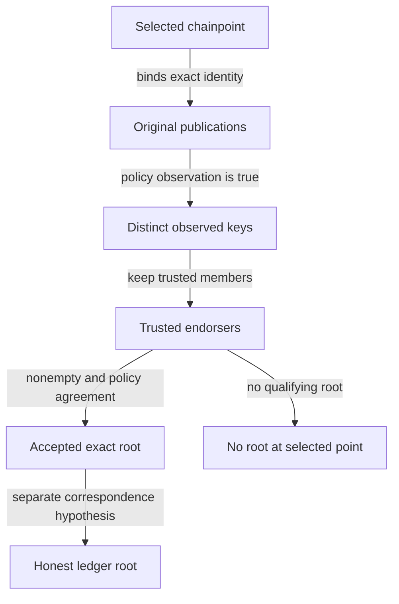
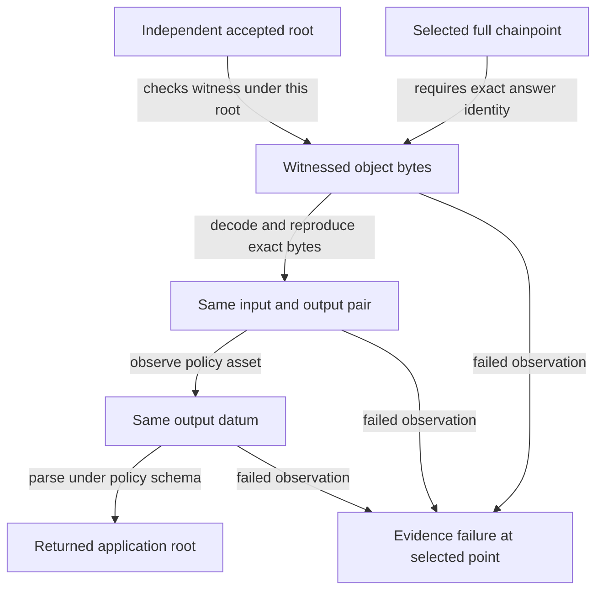

# Inspect roots, sessions and ledger answers

As a design reviewer, run a terminal's root choice against trusted and untrusted publications. An honest scenario returns the accepted root and selected chainpoint. A publication from an untrusted key returns `no-root` at that same point, even when signature validity is assumed. Removing the trusted-set check demonstrates why that refusal matters.

A terminal also acquires exactly its selected point, repeats reads from that session, and receives the original-point refusal when the provider is absent, offers another point, or the session expires.

A terminal then verifies the ledger answer against its independently accepted root. An honest answer returns the application root in the witnessed output's datum. A witness valid only under a provider root refuses at the selected point. Two honest outputs carrying the same asset show why a separate uniqueness assumption is needed.

This is an executable project model and simulator. Component implementations, cryptography, deployment and live-chain behavior require separate evidence. Review the model and this page from the same Git revision. Inherited session links retain their published source branch. Ledger source links reference the published model revision. Its model bytes must match the reviewed candidate. Acceptance and source publication are separate evidence.

## Run the scenarios

From the repository root, with Nix flakes enabled:

```bash
./lean/env lake build
./lean/env lake exe lockness-sim accept-root honest
./lean/env lake exe lockness-sim accept-root untrusted-key
./lean/env lake exe lockness-sim accept-root subset-mutation
./lean/env lake exe lockness-sim session honest
./lean/env lake exe lockness-sim session absent-point
./lean/env lake exe lockness-sim session newer-point
./lean/env lake exe lockness-sim ledger honest
./lean/env lake exe lockness-sim ledger substituted-root
./lean/env lake exe lockness-sim ledger duplicate-asset
./tools/check-model.sh
./tools/check-docs.sh
just ci
```

`lean/env` enters the `lean/` directory with revision-pinned Lean 4.29.0 and its C compiler, and rejects a different Lean version. For an interactive pinned environment, run `./lean/env bash`; there the commands are `lake build` and `lake exe lockness-sim accept-root <scenario>`. The [toolchain file](https://github.com/lambdasistemi/lockness/blob/feat/7-session-acquisition/lean/lean-toolchain) also supports standard Elan workflows. Ledger sets use Mathlib `Finset` at revision `8a178386ffc0f5fef0b77738bb5449d50efeea95`, with narrow finite-set imports and every transitive Lake revision recorded in the [manifest](https://github.com/lambdasistemi/lockness/blob/3b88416def14c9d2da0d04ab0d595e5de7b91493/lean/lake-manifest.json). Lean and Nix pins are unchanged. The environment supplies pinned Git, Curl and Zstd and rehydrates the required Mathlib cache from the committed dependency graph when needed. Dependency and cache acquisition are setup, not proof evidence.

| Scenario | Observable result |
| --- | --- |
| Honest publications | `accepted-root`, full selected point, exact root scheme and bytes, two distinct endorsers despite a duplicate publication |
| Untrusted key | `no-root`, full selected point, signature validity explicitly labelled an abstract assumption |
| Removed trusted-set check | Production refuses; the mutation accepts the untrusted root and has a compiled refutation of the unchanged safety statement |
| Honest session | Exact point and independently obtained root; two unchanged active reads, expiry refusal and release to closed |
| Absent point | `unavailablePoint` at the selected point |
| Newer point | `unavailablePoint` at the selected point; same-slot alternate hash and alternate network also refuse |
| Honest ledger answer | Application root of the authenticated output; independent root acceptance is executed first, provider root fields are ignored |
| Substituted root | Witness succeeds under the answer's root and fails under the independent accepted root; verifier returns selected-point `evidenceFailure` |
| Duplicate asset | Two distinct finite honest members carrying the same asset both verify, returning different datum roots; OneShot and the unique-output conclusion are false |

An unexpected scenario outcome exits nonzero. Unknown commands, missing scenario arguments and unknown root, session or ledger scenarios exit with usage code 64. These are executable model observations, without a network, ledger provider or signature implementation.

## Follow the acceptance boundary



The terminal supplies its policy and selected point. For each proposed root, `acceptRoot` finds publications at the exact network, slot and block hash, with that root's exact scheme and bytes. It passes the original publication, including unchanged signature and message sequences, to an arbitrary Boolean observation supplied by the policy. It deduplicates keys, keeps trusted members, and accepts the first root whose nonempty distinct endorsement satisfies the supplied agreement. Untrusted publications cannot manufacture agreement or prevent qualifying trusted publications from being considered.

```lean
acceptRoot : Policy → List Publication → Chainpoint → Except Refusal Root
```

The [acceptance definition](https://github.com/lambdasistemi/lockness/blob/feat/7-session-acquisition/lean/Lockness/Root.lean) returns `noRoot selectedPoint` when no proposal qualifies. The shared refusal type has exactly three constructors: `noRoot`, `unavailablePoint` and `evidenceFailure`, each carrying the selected point. Root acceptance only emits `noRoot`; session acquisition emits `unavailablePoint`. Ledger verification emits `evidenceFailure`; all three retain the selected point.

| Design choice | Alternative | Reason |
| --- | --- | --- |
| Policy supplies arbitrary executable observations | Compute an arbitrary validity proposition | Arbitrary propositions are not generally executable; signature soundness stays an explicit hypothesis |
| Distinct keys endorse the exact point and root | Count publication copies | Repeated messages cannot invent independent endorsement |
| Filter trusted members before agreement | Let irrelevant untrusted publications prevent acceptance | Trust belongs to the terminal's selected policy |
| Require nonempty endorsement | Let a permissive agreement accept no evidence | Agreement alone cannot authorize an empty set |
| Separate honest-root correspondence | Infer ledger correctness from signatures and agreement | Trusted publishers can endorse a wrong ledger root |

## Read the model contracts

The [shared types](https://github.com/lambdasistemi/lockness/blob/3b88416def14c9d2da0d04ab0d595e5de7b91493/lean/Lockness/Types.lean) preserve exact byte sequences. Network and root scheme are explicit byte identities, slot is a natural number, and every equality includes all fields. There is no normalization, serialization, hashing or signing algorithm.

| Surface | Contract in this slice |
| --- | --- |
| `Bytes`, `Chainpoint`, `Root`, `Publication` | Original byte sequences, exact point/root identities and original message/signature evidence |
| `Policy` | Trusted keys, agreement and publication observations; selected asset/schema and explicit byte decoding, witness, asset and datum observations |
| `Refusal` | Exactly the three selected-point refusals |
| `Session` | Selected point and root; acquisition and lifecycle in the session module, described below |
| `LedgerAnswer` | Point, exact object/witness bytes and untrusted provider root; verification is described below |
| `AppAnswer` | Application identity, context, point, root, claim, exact value and proof; no application verification behavior |

`SigValid publication` is an uncomputed proposition supplied by an implicit, arbitrary `SignatureModel`. The project defines no global instance fixing validity. `ObservationSound policy` explicitly assumes that a true observation implies this predicate. Neither an observation nor the model simulator implements signature verification. Signature encodings, key rotation and cryptographic correctness remain external contracts.

The [general proofs](https://github.com/lambdasistemi/lockness/blob/feat/7-session-acquisition/lean/Lockness/RootProofs.lean) state their guarantees over arbitrary policies, publications and selected points:

| Declaration | Established model guarantee |
| --- | --- |
| `acceptRoot_safe` | Successful acceptance has nonempty distinct trusted endorsers satisfying agreement, with original publication witnesses at the exact point and root |
| `acceptRoot_valid` | The same witnesses have abstract signature validity under the explicit observation-soundness hypothesis |
| `acceptRoot_refusal` | Any refusal from this function is exactly `noRoot` at the selected point |
| `acceptRoot_honest` | Accepted root equals the downstream honest root only under separate `HonestRootCorrespondence` |

The [counterexamples](https://github.com/lambdasistemi/lockness/blob/feat/7-session-acquisition/lean/Lockness/Counterexamples/SubsetMutation.lean) give an inhabited abstract validity hypothesis for an untrusted publication, prove its refusal, constructively refute safety after removing trusted-set checking, and show that endorsement alone does not establish an honest ledger root.

## Acquire the selected session

As a terminal, retain one selected ledger identity while the provider follows new blocks. The [session model](https://github.com/lambdasistemi/lockness/blob/feat/7-session-acquisition/lean/Lockness/Session.lean) treats a provider as an arbitrary `Chainpoint → Option Session`, with no honesty restriction. `Session.point` is definitionally its stored `selectedPoint`. Acquisition checks complete network, slot and block-hash equality and returns the entire offered session unchanged; it never rewrites an offer to look like the requested point.

```lean
acquire : Chainpoint → Provider → Except Refusal Session
NoSubstitution : (Chainpoint → Provider → Except Refusal Session) → Prop
```

Successful acquisition establishes point coherence and preservation of the offered root and bytes. It does not establish that the provider's `acceptedRoot` was independently accepted. Root acceptance remains a separate terminal operation; cryptographic observation soundness and honest-root correspondence remain separate hypotheses. The honest simulator obtains its root by executing `acceptRoot` before offering the session. Other arbitrary providers can offer any root at that point.

<!-- diagram: session -->
<div class="diagram"><a href="../diagrams/session.png?v=42c240417184fe73"></a></div>
<p class="diagram-links"><a href="../diagrams/session.png?v=42c240417184fe73">Open full size</a> · <a href="../diagrams/session.mmd?v=814064504407234d">Mermaid source</a></p>

The diagram preserves the [session design](../design/chainpoints.md). The executable inductive `SessionState` and `SessionTransition` model requested acquisition as active or unavailable, active reads as active again, expiry as expired, and release as closed. `readSession` returns the same active session; expired and closed reads return `unavailablePoint` at its original point. Requested and unavailable reads also refuse their selected point. Closed and unavailable states have no outgoing transitions; an expired-read observation retains the expired state. Expiry is an event, with no duration or scheduler. The diagram's unresolved branch path is deliberately absent from the transition relation and remains a separate design question. The model does not implement pagination, token encodings, leases, storage retention or physical view release.

| Declaration | Model guarantee |
| --- | --- |
| `acquire_no_substitution` | For every point, arbitrary provider and successful session, the full session point equals the requested point |
| `acquire_preserves_offer` | Every successful session is exactly the provider's original offer, including all root fields and bytes |
| `acquire_absent` | Every provider absent at the selected point yields that point's unavailable refusal |
| `acquire_mismatch`, `acquire_refusal` | Any differing full point refuses; every acquisition error is precisely the selected-point unavailable refusal |
| `active_read`, `expired_read`, `closed_read` | Active reads preserve the session; expiry and closed reads refuse its point |
| `requested_transition`, `active_transition`, `expired_transition` | Inversions constrain every transition to the declared lifecycle destinations |
| `closed_terminal`, `unavailable_terminal` | Those states have no outgoing transition |

| Choice | Alternative | Reason |
| --- | --- | --- |
| Check the entire chainpoint | Compare only slots or accept the latest offer | Network and competing block hashes identify different ledger states |
| Return the unchanged provider session | Relabel its point after acceptance | Relabelling would conceal substitution and break evidence binding |
| Declare lifecycle events and observations | Introduce lease durations and retention machinery | Those service policies have no agreed implementation contract yet |

The [session tests](https://github.com/lambdasistemi/lockness/blob/feat/7-session-acquisition/lean/Lockness/Tests/Session.lean) prove concrete honest, absent, newer-slot, alternate-hash and alternate-network outcomes. Their permanent executable check obtains a successful session, performs two active reads, and requires expiry and closed-state refusal. These checks exercise the abstract session value rather than a ledger read service.

## Verify ledger answers

As a terminal, use a provider's answer to identify the application root carried by an asset's honest ledger output. Supply the root independently accepted for the selected network, slot and block hash. The [ledger verifier](https://github.com/lambdasistemi/lockness/blob/3b88416def14c9d2da0d04ab0d595e5de7b91493/lean/Lockness/Ledger.lean) checks answer-point equality, decodes the object to exact input/output bytes, and requires re-encoding to reproduce the witnessed object unchanged. It checks the witness against the independent root argument and those original object bytes. It then checks the asset on that same decoded output, extracts its datum, and parses those bytes under the policy schema. Every failed observation returns `evidenceFailure session.selectedPoint`.

```lean
verifyLedger : Policy → Root → Session → LedgerAnswer → Except Refusal Root
Ledger := Chainpoint → Finset (TxIn × TxOut)
```

The provider's `answer.root` and `session.acceptedRoot` are neither authorities nor required equality conditions. An honest answer can succeed when both disagree with the accepted root. Acquisition only establishes point coherence; it cannot create root endorsement or honest-root correspondence. Root acceptance's trusted endorsement and the separate selected-point correspondence hypothesis remain distinct.



The [soundness proof](https://github.com/lambdasistemi/lockness/blob/3b88416def14c9d2da0d04ab0d595e5de7b91493/lean/Lockness/LedgerProofs.lean) quantifies arbitrary policies, finite ledgers, roots, sessions, answers and interpretations. Under all the following premises, successful verification identifies a member at the selected point which actually carries the policy asset, has the returned honest datum root, and equals every other member carrying that asset.

| Explicit premise | What it supplies |
| --- | --- |
| Selected-point honest-root correspondence | Independent accepted root equals the honest commitment for this exact selected point |
| `WitnessSound` | A successful witness check under the honest root implies membership of the exact input/output pair |
| `ObjectEncodingFaithful` | The policy's representation is injective on exact input/output byte pairs; this is an external representation assumption |
| `AssetObservationSound` | A successful asset observation implies that the same output actually carries that asset |
| `DatumObservationSound` | Extraction and parsing of that same output's bytes under the selected schema agree with its honest datum root |
| `OneShot` | At every point, any two member pairs carrying the selected asset are equal |

`verifyLedger_observations` exposes the full successful path, including exact bytes and every interpretation observation. `verifyLedger_refusal` proves the selected-point evidence refusal for every error. `verifyLedger_sound : LedgerSoundness verifyLedger` proves the complete member, asset, honest datum-root and unique-pair conclusion. Encoding injectivity remains an explicit premise of the frozen contract; byte binding itself uses the executable re-encoding equality. These predicates do not implement cryptography, a datum format, CSMT internals or Cardano serialization.

The [honest fixtures](https://github.com/lambdasistemi/lockness/blob/3b88416def14c9d2da0d04ab0d595e5de7b91493/lean/Lockness/Counterexamples/LedgerFixtures.lean) inhabit all premises together with selected-point correspondence and acceptance. Their reversible framing preserves zero bytes, order and `255`, and its injectivity is proved for arbitrary byte pairs. This framing is only an example of an abstract representation. The honest ledger has one member; the unrestricted ledger type also admits two different outputs carrying the same asset. No uniqueness restriction is hidden in its type.

The [root-substitution witness](https://github.com/lambdasistemi/lockness/blob/3b88416def14c9d2da0d04ab0d595e5de7b91493/lean/Lockness/Counterexamples/LedgerRootMutation.lean) passes point, decoding, byte binding, asset and datum conditions. Its unchanged witness succeeds under the provider root and fails at the real accepted-root boundary. A compiled mutation of the actual verifier, checking either the answer root or session root, accepts the impostor and constructively falsifies the unchanged `LedgerSoundness` statement. The original proof and actual simulator outcome assertion then reject that mutation.

The [duplicate-asset refutation](https://github.com/lambdasistemi/lockness/blob/3b88416def14c9d2da0d04ab0d595e5de7b91493/lean/Lockness/Counterexamples/LedgerUniqueness.lean) has two distinct honest finite members, the same asset, different datum roots and two successful answers under one independent root. Witness, encoding, asset and datum assumptions and selected-point correspondence all hold. Only OneShot is false. Removing exactly that premise from the universal statement leaves its complete conclusion unchanged; a constructive proof negates the resulting guarantee. A failed tactic is not used as the counterexample.

| Choice | Alternative | Why |
| --- | --- | --- |
| Genuine finite sets | Unrestricted lists | Ground truth has finite-set membership and equality semantics |
| Independently accepted root argument | Check under provider answer/session root | A provider cannot endorse its own evidence |
| Preserve and bind the same object bytes | Observe a separately decoded or normalized output | Membership must authenticate the output whose asset and datum are interpreted |
| Explicit executable callbacks and soundness predicates | Treat Boolean success as semantic truth | Witness correctness and interpretation correspondence remain separately assumed |
| Separate OneShot premise | Forbid duplicate assets in every ledger value | Membership and unique state are different claims; the counterexample stays reachable |

## Assess the evidence

`check-model` builds every model module, inventories every stored theorem including private proofs, and reports its axiom dependencies. It permits only Lean's standard `propext`, `Classical.choice` and `Quot.sound`; holes and custom escape axioms fail. Lean checks anonymous examples during compilation but does not retain them in the declaration inventory: strict compiler warnings and a source hole policy reject their holes. Deliberate named and anonymous `sorry`, `admit` and unused custom-axiom controls must reach the relevant rejection, rather than fail because a tool or import is missing.

The gate executes all three root, session and ledger scenarios, runs the permanent lifecycle check, and compiles the root, session and ledger counterexamples. It also records the types and axiom dependencies of every stored named model declaration, rather than selecting only the main proofs. Ledger tests cover each network/slot/hash mismatch, decode and byte-binding failures, witness/asset/schema/datum refusals, ignored provider roots and jointly inhabited acceptance premises. In temporary build directories it removes the production trust filter, compiles the mutated definition, proves the unchanged universal safety statement false, and separately retains the failed unchanged proof output. It also checks compiled changed outcomes and proof rejection for observation, point/root binding, nonempty endorsement, agreement and refusal-point faults. The untrusted-key simulator must reject the unexpected result of the production subset mutation. This is a finite collection of negative controls, not a claim of exhaustive mutation coverage.

The session control copies the actual production acquisition definition into an isolated build directory, removes only its point-equality guard, then recompiles the session counterexample module and session simulator against that mutated module. The existing unchanged root dependencies are copied as compiled inputs; this control does not rebuild the full dependent closure. The compiled mutant executes newer-point acceptance and constructively refutes the unchanged `NoSubstitution` proposition. The exact unchanged `acquire_no_substitution` proof then fails at its point-equality conclusion, and the real newer-point simulator rejects the changed outcome. The general refutation helper applies to any operation with that acceptance witness, rather than only a separate fake acquisition copy.

Run `./lean/env lake env lean Lockness/Tests/Session.lean` or `./lean/env lake env lean Lockness/Counterexamples/SessionMutation.lean` for session checks and the [generic refutation](https://github.com/lambdasistemi/lockness/blob/feat/7-session-acquisition/lean/Lockness/Counterexamples/SessionMutation.lean). Run `./lean/env lake env lean Lockness/Counterexamples/SubsetMutation.lean` to inspect the constructive counterexample independently. Record `git rev-parse HEAD` alongside command output when assessing a candidate. CI invokes the same model and documentation commands; the source workflow alone is not evidence that remote CI has passed.

| Evidence layer | Limit |
| --- | --- |
| Design | Records the project trust boundary and open contracts |
| Model and simulator | Kernel-checked properties of this root and session model and concrete executable paths |
| Documentation checks | Presentation, speech freshness and strict site construction |
| Independent acceptance and remote CI | Require revision-bound review and actual successful workflow results |
| Component implementation, deployment and live chain | Not established by this model |

The Lean kernel remains part of the trust base. Observation soundness and honest-root correspondence are external assumptions. The executable guard and statement share the definition of a qualifying candidate; the mutation checks preserve that statement while altering execution, and do not independently prove specification fidelity. Concrete ledger witness construction, application proof verification, effects, canonicality, freshness, settlement and abandoned-branch session policy remain later work. Ledger soundness additionally assumes honest commitment correspondence, witness and interpretation soundness, faithful representation and OneShot; no model proof establishes these for a deployed system. Consume model and documentation by reviewed revision; a tagged binary distribution pipeline remains future implementation work.

Continue to [design decisions and remaining guarantees](../design/decisions.md) and the [project architecture](../architecture/system.md).
