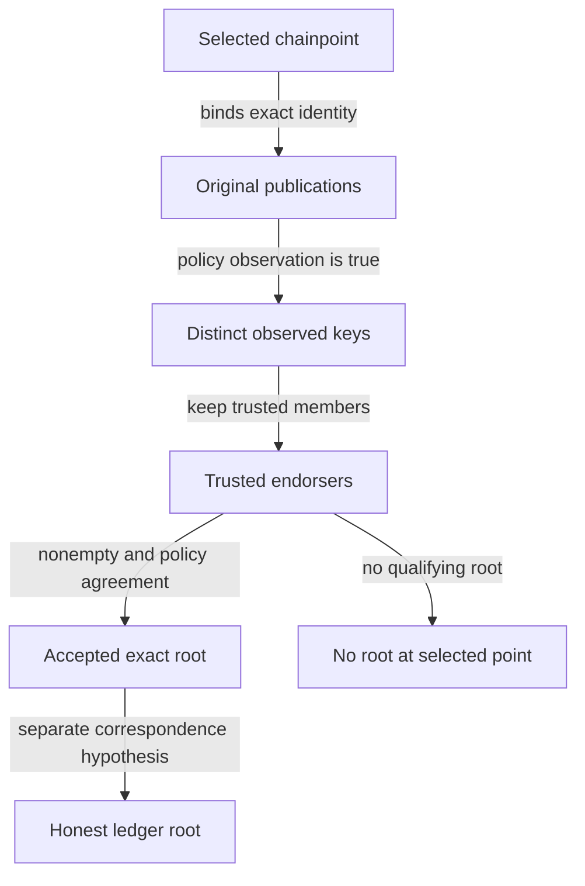
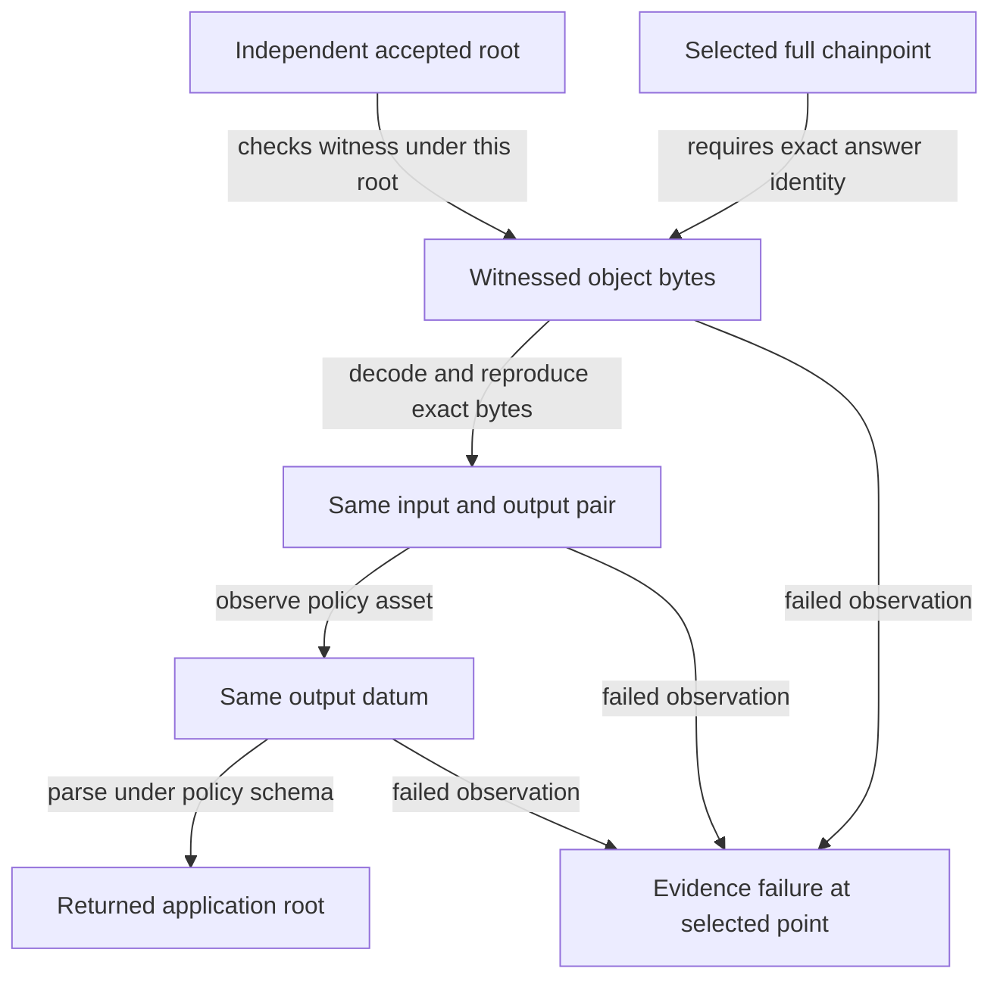
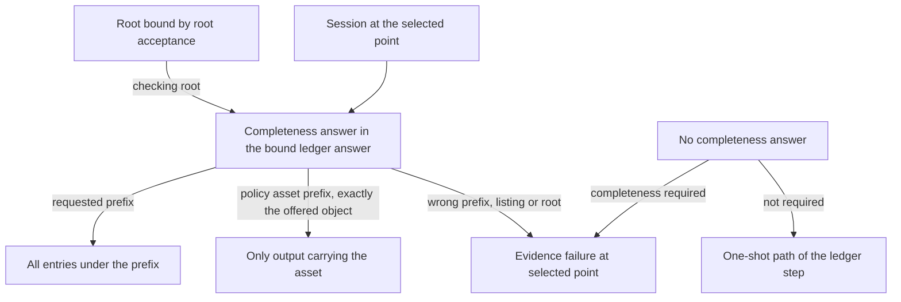

# Inspect roots, sessions, ledger answers, application claims, verdicts, the operating context and the act step

As a design reviewer, run a terminal's root choice against trusted and untrusted publications. An honest scenario returns the accepted root and selected chainpoint. A publication from an untrusted key returns `no-root` at that same point, even when signature validity is assumed. Removing the trusted-set check demonstrates why that refusal matters.

A terminal also acquires exactly its selected point, repeats reads from that session, and receives the original-point refusal when the provider is absent, offers another point, or the session expires.

A terminal then verifies the ledger answer against its independently accepted root. An honest answer returns the application root in the witnessed output's datum. A witness valid only under a provider root refuses at the selected point. Two honest outputs carrying the same asset show why a separate uniqueness assumption is needed.

Finally, a terminal accepts an application claim only after root acceptance, exact-point acquisition, ledger verification and every application link have succeeded. An honest builder yields a verified claim. A builder that claims another root is refused at the selected point, even with a proof valid under that root. A two-link chain is checked link by link, and a failure at the second link rejects the whole claim. Under the stated root, ledger and application soundness premises plus functional application content, two providers and two builders cannot make the terminal accept two different claims for the same policy, publications and point; without functional content they can.

Around all of this, the terminal classifies every outcome as verified, refused or unverified. A verified verdict carries exactly the claim that acceptance returned. A refused verdict carries acceptance's own refusal at the selected point. Unverified traffic is a first-class case for a declared absence only: no verifier configured, a session declared unbound, or a session bound to the selected point offering neither a witness nor a completeness answer. With a verifier configured, a present but wrong witness, a completeness answer on a session bound to the selected point that fails its check, or a session bound to another point, is refused, and in every case an answer without a witness can never be promoted to verified.

All of it happens inside one declared operating context: the network the terminal runs on and the commitment schemes it accepts. With a verifier configured, a selected point on another network, or a root under a scheme the terminal does not accept, is refused at the selected point, never reported as unverified; a terminal without a verifier reports every outcome, this one included, as unverified with reason no verifier. A publication from another network is ignored: it neither endorses a root here nor blocks one.

A ledger answer can also carry a completeness proof: the object bytes stored under a key prefix and a proof checked under the accepted root. A terminal can then accept every entry under an address prefix, or the one output carrying its asset without assuming the minting policy is one-shot, under the completeness and key-layout hypotheses together with the honest-root, encoding and observation premises the completeness section names. A terminal that requires completeness refuses an answer without it; one that does not keeps the one-shot path.

A ledger answer can also carry an application's transaction history without a proof per transaction. The terminal keeps the relevant transactions, rebuilds the application state from them and accepts the history only when the rebuilt root equals the application root of the state output it verified at the selected point. Two guarantees follow, depending on what that root commits to. For a state commitment, the rebuilt state is the honest state, while the accepted transaction list may differ from the honest one, as when a pair of transactions cancels. For a history commitment, the accepted relevant transactions are also exactly the honest ones. Irrelevant transactions never change the outcome.

Last, the terminal acts. It may build a transaction from a verified claim before any settlement, but it drives an external effect only on a verified claim, with an offer bound to the selected point and the policy's settlement observation holding on its own chain view. Settlement is a guarantee conditional on stated hypotheses about which futures consensus admits, never an unconditional promise. After the selected block is rolled back, the session is abandoned, its reads are refused at the same point, and the effect stays refused. An unverified verdict never drives an effect, and it allows construction only when the policy's action rule admits its reason.

This is an executable project model and simulator. Component implementations, cryptography, deployment and live-chain behavior require separate evidence. Review the model and this page from the same Git revision. Inherited session links retain their published source branch. Ledger source links reference the published ledger model revision, application source links reference the published application model revision, verdict source links reference the published verdict model revision, operating context source links reference the published context model revision, act source links reference the published act model revision, completeness source links reference the published completeness model revision, and history source links reference the published history model revision. Its model bytes must match the reviewed candidate. Acceptance and source publication are separate evidence.

## Run the scenarios

From the repository root, with Nix flakes enabled:

```bash
./lean/env lake build
./lean/env lake exe lockness-sim accept-root honest
./lean/env lake exe lockness-sim accept-root untrusted-key
./lean/env lake exe lockness-sim accept-root subset-mutation
./lean/env lake exe lockness-sim session honest
./lean/env lake exe lockness-sim session absent-point
./lean/env lake exe lockness-sim session newer-point
./lean/env lake exe lockness-sim ledger honest
./lean/env lake exe lockness-sim ledger substituted-root
./lean/env lake exe lockness-sim ledger duplicate-asset
./lean/env lake exe lockness-sim app honest
./lean/env lake exe lockness-sim app replaced-root
./lean/env lake exe lockness-sim app nested
./lean/env lake exe lockness-sim app ambiguous-value
./lean/env lake exe lockness-sim verdict verified
./lean/env lake exe lockness-sim verdict no-witness
./lean/env lake exe lockness-sim verdict unbound-session
./lean/env lake exe lockness-sim verdict no-verifier
./lean/env lake exe lockness-sim verdict wrong-witness
./lean/env lake exe lockness-sim verdict misbound
./lean/env lake exe lockness-sim verdict promoted
./lean/env lake exe lockness-sim context honest
./lean/env lake exe lockness-sim context wrong-network-point
./lean/env lake exe lockness-sim context wrong-network-publication
./lean/env lake exe lockness-sim context unaccepted-scheme
./lean/env lake exe lockness-sim context unbound-message
./lean/env lake exe lockness-sim effect construct
./lean/env lake exe lockness-sim effect settled-effect
./lean/env lake exe lockness-sim effect rolled-back
./lean/env lake exe lockness-sim effect unverified-construct
./lean/env lake exe lockness-sim effect unverified-effect
./lean/env lake exe lockness-sim completeness address-prefix
./lean/env lake exe lockness-sim completeness asset-unique
./lean/env lake exe lockness-sim completeness omitted-entry
./lean/env lake exe lockness-sim completeness extra-entry
./lean/env lake exe lockness-sim completeness empty-prefix
./lean/env lake exe lockness-sim completeness unsound-proof
./lean/env lake exe lockness-sim history accepted
./lean/env lake exe lockness-sim history forged-transaction
./lean/env lake exe lockness-sim history missing-relevant
./lean/env lake exe lockness-sim history irrelevant-extras
./lean/env lake exe lockness-sim history root-comparison-removed
./lean/env lake exe lockness-sim history context-dependent-relevance
./lean/env lake exe lockness-sim history cancelling-pair
./tools/check-model.sh
./tools/check-docs.sh
just ci
```

`lean/env` enters the `lean/` directory with revision-pinned Lean 4.29.0 and its C compiler, and rejects a different Lean version. For an interactive pinned environment, run `./lean/env bash`; there the commands are `lake build` and `lake exe lockness-sim accept-root <scenario>`. The [toolchain file](https://github.com/lambdasistemi/lockness/blob/feat/7-session-acquisition/lean/lean-toolchain) also supports standard Elan workflows. Ledger sets use Mathlib `Finset` at revision `8a178386ffc0f5fef0b77738bb5449d50efeea95`, with narrow finite-set imports and every transitive Lake revision recorded in the [manifest](https://github.com/lambdasistemi/lockness/blob/3b88416def14c9d2da0d04ab0d595e5de7b91493/lean/lake-manifest.json). Lean and Nix pins are unchanged. The environment supplies pinned Git, Curl and Zstd and rehydrates the required Mathlib cache from the committed dependency graph when needed. Dependency and cache acquisition are setup, not proof evidence.

| Scenario | Observable result |
| --- | --- |
| Honest publications | `accepted-root`, full selected point, exact root scheme and bytes, two distinct endorsers despite a duplicate publication |
| Untrusted key | `no-root`, full selected point, signature validity explicitly labelled an abstract assumption |
| Removed trusted-set check | Production refuses; the mutation accepts the untrusted root and has a compiled refutation of the unchanged safety statement |
| Honest session | Exact point and independently obtained root; two unchanged active reads, expiry refusal and release to closed |
| Absent point | `unavailablePoint` at the selected point |
| Newer point | `unavailablePoint` at the selected point; same-slot alternate hash and alternate network also refuse |
| Honest ledger answer | Application root of the authenticated output; independent root acceptance is executed first, provider root fields are ignored |
| Substituted root | Witness succeeds under the answer's root and fails under the independent accepted root; verifier returns selected-point `evidenceFailure` |
| Duplicate asset | Two distinct finite honest members carrying the same asset both verify, returning different datum roots; OneShot and the unique-output conclusion are false |
| Honest application claim | Claim at the selected point with the accepted ledger root, the application root and the final value; two providers with different untrusted roots and two builders with different proof bytes yield the same claim in a fixture that satisfies every premise |
| Replaced application root | The answer claims another root with a proof valid there and passes every other check; the proof fails under the trusted root, and accept returns selected-point `evidenceFailure` |
| Nested application root | Both links are checked and the inner root is reported; a bad proof, replaced root or missing answer at the second link, or fuel 1 or 0, refuses the whole claim |
| Ambiguous value | Two values are committed for one query under one root; two builders make accept return two different claims, so invariance needs the separate functional premise |
| Verified verdict | A session bound to the selected point offers the honest witness and carries reconstruction material; the verdict is verified with exactly the claim accept returns |
| No witness | The bound session offers the honest object without a witness or a completeness answer; the verdict is unverified with reason no witness, and accept refuses with selected-point `evidenceFailure` |
| Unbound session | The session declares no binding while offering a valid witness; the verdict is unverified with reason unbound session, accept refuses, and the terminal adopts no point |
| No verifier | The policy declares no verifier; the verdict is unverified with reason no verifier, although accept on the same offer would succeed |
| Wrong witness | The bound session offers a witness that fails under the accepted root; the verdict is refused with selected-point `evidenceFailure`, never unverified |
| Misbound session | The session declares a binding to another point and is otherwise honest; the verdict is refused with selected-point `evidenceFailure`, never unverified |
| Promotion attempt | The impostor object from the root-substitution witness is offered bound but without a witness or a completeness answer; the verdict stays unverified with reason no witness and accept refuses |
| Context honest | The terminal runs on network `[0]` and accepts scheme `[0]`; the honest offer is verified with the same claim accept returns, and the claim's network and scheme are printed from the claim |
| Wrong-network point | The terminal has a verifier and is configured for network `[1]` while the selected point is on network `[0]`; with a bound, witnessed session and with an unbound session alike, the verdict is refused with selected-point `evidenceFailure`, never unverified |
| Wrong-network publication | A trusted key's verified publication of the honest root at the same slot and block hash on network `[1]` is appended to the honest publications, and the verdict is the same verified claim; when the only endorsements are on network `[1]`, the verdict and accept are `noRoot` at the selected point, never unverified |
| Unaccepted scheme | The terminal accepts only scheme `[1]` and the honest root uses scheme `[0]`; the verdict is refused with selected-point `evidenceFailure` |
| Unbound message | Under a policy that checks signatures only, publications at the selected point on network `[0]` are signed over messages that name a point on network `[1]`; the verdict is verified, which only the message-binding hypothesis excludes |
| Construct | The honest claim is verified; construction is authorized at the unsettled tip and gives the same outcome on a settled chain; the effect at the tip is refused with selected-point `evidenceFailure` |
| Settled effect | The settlement observation holds after newer blocks; the effect is authorized on the claim; the same verdict handed to the act step with an unbound offer is refused with selected-point `evidenceFailure` |
| Rolled back | The effect at the tip is refused; the selected block is rolled back in an admitted future and leaves the canonical branch; the session is abandoned and its read is `unavailablePoint` at the selected point; the effect stays refused on the rolled-back and regrown chains |
| Unverified construct | A verdict unverified with reason no witness allows construction on the acquired offer, and its reconstruction material is printed; verdicts with no verifier or an unbound session are refused construction by the action rule |
| Unverified effect | On a settled chain, the effect is refused for no witness, unbound session, no verifier, and no verifier on a terminal configured for another network |
| Address prefix | The honest listing for an address prefix is accepted at the selected point under the accepted root, with exactly the honest entries under that prefix; a listing that checks only under the provider root, a valid proof for a narrower prefix and an answer without completeness are each refused with selected-point `evidenceFailure` |
| Asset unique | With one holder, the asset listing of that output gives the verified claim; on a ledger with two holders, the honest two-entry listing and a listing omitting a holder are refused, while no completeness answer is verified through the one-shot path; a policy requiring completeness refuses that same answer; a wrong listing without a witness is refused, and an answer with neither is unverified with reason no witness |
| Omitted entry | A listing that leaves out an honest member under the prefix is refused with selected-point `evidenceFailure` |
| Extra entry | A listing that adds an output not in the ledger is refused with selected-point `evidenceFailure` |
| Empty prefix | The zero-length prefix with the whole ledger listed is accepted; a prefix holding nothing with an empty listing is accepted with no entries; an empty listing for a populated prefix is refused |
| Unsound proof | Under a check that accepts every listing, which violates the completeness hypothesis, the real acceptance accepts a listing missing an honest member |
| Accepted history | The honest two-transaction history is verified at the selected point; the claim carries the honest relevant transactions and the rebuilt state, whose root equals the verified datum root; the accepted root differs from the provider's root |
| Forged transaction | A history with another relevant transaction in place of an honest one is refused with selected-point `evidenceFailure`, never unverified |
| Missing relevant transaction | A history missing an honest relevant transaction is refused with selected-point `evidenceFailure`, never unverified |
| Irrelevant extras | Foreign transactions before, between and after the honest ones give exactly the accepted claim and state |
| Root comparison removed | The real check refuses the forged history; the variant without the root comparison accepts it, which refutes the unchanged sequence guarantee with every premise held |
| Context-dependent relevance | With a foreign transaction in front, the real check verifies the honest history; a selector that reads the whole answer refuses it although both histories have the same relevant transactions, which refutes the unchanged tolerance guarantee |
| Cancelling pair | A history omitting a cancelling pair is verified; its rebuilt state equals the honest state while its transactions differ from the honest ones, so state soundness holds and the sequence premise fails for this fold |

An unexpected scenario outcome exits nonzero. Unknown commands, missing scenario arguments and unknown root, session, ledger, app, verdict, context, effect, completeness or history scenarios exit with usage code 64. Each verdict scenario prints the verdict, accept's own outcome and the selected point; each context scenario also prints the terminal's context, and the two-observation scenarios print their second verdict and accept beside the first. Each effect scenario prints the act outcomes it observes and the selected point. Each completeness scenario prints the acceptance or verdict outcomes it observes and the selected point; its expected entries come from the fixture ledger and key layout, and its expected claims from the honest application content. Each history scenario prints the classification and the selected point. The six scenarios on the history-commitment fixture also print the accepted root beside the provider's root and the checking root taken from the verified state output; the cancelling-pair scenario prints instead the rebuilt state beside the honest state and the accepted transactions beside the honest ones. Expected claims come from the fixtures' honest history, honest datum root and semantics, never from acceptance. These are executable model observations, without a network, ledger provider or signature implementation.

## Follow the acceptance boundary



The terminal supplies its policy and selected point. For each proposed root, `acceptRoot` finds publications at the exact network, slot and block hash, with that root's exact scheme and bytes. It passes the original publication, including unchanged signature and message sequences, to an arbitrary Boolean observation supplied by the policy. It deduplicates keys, keeps trusted members, and accepts the first root whose nonempty distinct endorsement satisfies the supplied agreement. Untrusted publications cannot manufacture agreement or prevent qualifying trusted publications from being considered.

```lean
acceptRoot : Policy → List Publication → Chainpoint → Except Refusal Root
```

The [acceptance definition](https://github.com/lambdasistemi/lockness/blob/feat/7-session-acquisition/lean/Lockness/Root.lean) returns `noRoot selectedPoint` when no proposal qualifies. The shared refusal type has exactly three constructors: `noRoot`, `unavailablePoint` and `evidenceFailure`, each carrying the selected point. Root acceptance only emits `noRoot`; session acquisition emits `unavailablePoint`. Ledger and application verification emit `evidenceFailure`; all three retain the selected point.

| Design choice | Alternative | Reason |
| --- | --- | --- |
| Policy supplies arbitrary executable observations | Compute an arbitrary validity proposition | Arbitrary propositions are not generally executable; signature soundness stays an explicit hypothesis |
| Distinct keys endorse the exact point and root | Count publication copies | Repeated messages cannot invent independent endorsement |
| Filter trusted members before agreement | Let irrelevant untrusted publications prevent acceptance | Trust belongs to the terminal's selected policy |
| Require nonempty endorsement | Let a permissive agreement accept no evidence | Agreement alone cannot authorize an empty set |
| Separate honest-root correspondence | Infer ledger correctness from signatures and agreement | Trusted publishers can endorse a wrong ledger root |

## Read the model contracts

The [shared types](https://github.com/lambdasistemi/lockness/blob/c341bd9e77c0a7586826597429bcadb50da4d77e/lean/Lockness/Types.lean) preserve exact byte sequences. Network and root scheme are explicit byte identities, slot is a natural number, and every equality includes all fields. There is no normalization, serialization, hashing or signing algorithm. The [verdict successor of the shared types](https://github.com/lambdasistemi/lockness/blob/6dfe20f49d7133019d0758fb2327e427b8a8d535/lean/Lockness/Types.lean) adds the declared binding, the optional witness, reconstruction material, the declared verifier and the verdict itself. The [operating context successor](https://github.com/lambdasistemi/lockness/blob/d9039c14e3105bdd512f9bb9d7e7c409f498de24/lean/Lockness/Types.lean) adds the terminal's declared context to the policy and the abstract message model with its binding hypothesis. The [act successor](https://github.com/lambdasistemi/lockness/blob/267093637a9f4133d1ab711e8134297cf934dcb9/lean/Lockness/Types.lean) adds branches and the chain, moves the reason type before the policy unchanged, and adds the settlement observation and the action rule to the policy. The [completeness successor](https://github.com/lambdasistemi/lockness/blob/d3c379997d57da5c276a647e0f32a421cd36ce8d/lean/Lockness/Types.lean) adds the completeness answer to the ledger answer and three completeness observations to the policy; inherited policies and answers take neutral values: a check that accepts nothing, an empty asset prefix, completeness not required and no answer. The [history successor](https://github.com/lambdasistemi/lockness/blob/bdeb31299f59779114208b90e8a81de4b3988045/lean/Lockness/Types.lean) moves the reconstruction type before the policy unchanged, adds the history answer and an opaque history state, adds an optional history answer to the ledger answer and four history observations to the policy; inherited policies and answers take neutral values: nothing relevant, a fold that keeps its state, an empty initial state, an empty root and no history.

| Surface | Contract in this slice |
| --- | --- |
| `Bytes`, `Chainpoint`, `Root`, `Publication` | Original byte sequences, exact point/root identities and original message/signature evidence |
| `Policy` | Trusted keys, agreement and publication observations; selected asset/schema and explicit byte decoding, witness, asset and datum observations; the fixed application query, application proof check, nested-root reading and link fuel; whether the terminal has a verifier, read only by the verdict; the operating context its trusted keys are trusted in; the settlement observation on the terminal's chain view and the action rule for unverified construction, read only by the act step; the executable completeness check over proof, checking root, key prefix and listed objects, the index key prefix of an asset, and whether the terminal requires completeness for the state output; whether a history transaction is relevant, the fold step over relevant transactions, the initial state and the state-root observation, read only by the history check |
| `Context` | The network identifier and the accepted commitment scheme identifiers; a scheme identifier carries its version |
| `MessageModel`, `MessageBinding` | What a signed message encodes, an arbitrary hypothesis like signature validity; binding assumes a valid signature's message encodes exactly its publication's point and root and nothing else |
| `Branch`, `Chain` | One branch's points, oldest first; the chain as the terminal's view, its canonical branch first, then the branches it replaced, most recent first |
| `Refusal` | Exactly the three selected-point refusals |
| `Session` | Selected point, provider root, the provider's untrusted answer to the policy's ledger query and the provider's declared binding; acquisition and lifecycle in the session module, described below |
| `LedgerAnswer` | Point, exact object bytes, an optional witness, untrusted provider root, optional reconstruction material, an optional completeness answer and an optional history answer; verification is described below |
| `HistoryAnswer`, `HistoryState` | Transactions with their resolved spent outputs in the provider's order, with no proof and no root of their own; an application state as opaque bytes; checked as described in [proof-free history](#check-proof-free-history) |
| `CompletenessAnswer` | The key prefix, every object stored under it as exact object bytes, and the proof bytes, as the provider offers them; untrusted until checked, described below |
| `Binding` | Either bound to a chainpoint or unbound, as the provider declares for its session |
| `Reconstruction` | Transaction bytes and resolved spent outputs, its own type distinct from every evidence type; the legacy reconstruction field is carried and never read as evidence, while history answers list values of the same type that the history check folds |
| `Reason`, `Verdict` | The terminal's classification: verified with a claim, refused with a refusal, or unverified with one of three payload-free reasons, no witness (for a bound answer carrying neither a witness nor a completeness answer), unbound session or no verifier; never a wire object |
| `AppAnswer` | Application identity, context, point, claimed root, claim, exact value and proof bytes; untrusted until application verification, described below |
| `AppQuery`, `AppProof`, `AppValue` | The terminal's fixed application, context and claim bytes; uninterpreted proof bytes; exact value bytes |
| `Claim` | Selected point, accepted ledger root, query, application root, checked nested roots and final value; no proof bytes or provider roots |

`SigValid publication` is an uncomputed proposition supplied by an implicit, arbitrary `SignatureModel`. The project defines no global instance fixing validity. `ObservationSound policy` explicitly assumes that a true observation implies this predicate. Neither an observation nor the model simulator implements signature verification. Signature encodings, key rotation and cryptographic correctness remain external contracts.

The [general proofs](https://github.com/lambdasistemi/lockness/blob/feat/7-session-acquisition/lean/Lockness/RootProofs.lean) state their guarantees over arbitrary policies, publications and selected points:

| Declaration | Established model guarantee |
| --- | --- |
| `acceptRoot_safe` | Successful acceptance has nonempty distinct trusted endorsers satisfying agreement, with original publication witnesses at the exact point and root |
| `acceptRoot_valid` | The same witnesses have abstract signature validity under the explicit observation-soundness hypothesis |
| `acceptRoot_refusal` | Any refusal from this function is exactly `noRoot` at the selected point |
| `acceptRoot_honest` | Accepted root equals the downstream honest root only under separate `HonestRootCorrespondence` |

The [counterexamples](https://github.com/lambdasistemi/lockness/blob/feat/7-session-acquisition/lean/Lockness/Counterexamples/SubsetMutation.lean) give an inhabited abstract validity hypothesis for an untrusted publication, prove its refusal, constructively refute safety after removing trusted-set checking, and show that endorsement alone does not establish an honest ledger root.

## Acquire the selected session

As a terminal, retain one selected ledger identity while the provider follows new blocks. The [session model](https://github.com/lambdasistemi/lockness/blob/feat/7-session-acquisition/lean/Lockness/Session.lean) treats a provider as an arbitrary `Chainpoint → Option Session`, with no honesty restriction. `Session.point` is definitionally its stored `selectedPoint`. Acquisition checks complete network, slot and block-hash equality and returns the entire offered session unchanged; it never rewrites an offer to look like the requested point.

```lean
acquire : Chainpoint → Provider → Except Refusal Session
NoSubstitution : (Chainpoint → Provider → Except Refusal Session) → Prop
```

Successful acquisition establishes point coherence and preservation of the offered root and bytes. It does not establish that the provider's `acceptedRoot` was independently accepted. Root acceptance remains a separate terminal operation; cryptographic observation soundness and honest-root correspondence remain separate hypotheses. The honest simulator obtains its root by executing `acceptRoot` before offering the session. Other arbitrary providers can offer any root at that point.

<!-- diagram: session -->
<div class="diagram"><a href="../diagrams/session.png?v=d3dae3e736f9b8c5"></a></div>
<p class="diagram-links"><a href="../diagrams/session.png?v=d3dae3e736f9b8c5">Open full size</a> · <a href="../diagrams/session.mmd?v=320b7b22e98125db">Mermaid source</a></p>

The diagram preserves the [session design](../design/chainpoints.md). The executable inductive `SessionState` and `SessionTransition` model requested acquisition as active or unavailable, active reads as active again, expiry as expired, and release as closed. `readSession` returns the same active session; expired and closed reads return `unavailablePoint` at its original point. Requested and unavailable reads also refuse their selected point. Closed and unavailable states have no outgoing transitions; an expired-read observation retains the expired state. Expiry is an event, with no duration or scheduler. The [abandoned state](https://github.com/lambdasistemi/lockness/blob/267093637a9f4133d1ab711e8134297cf934dcb9/lean/Lockness/Session.lean) follows a rollback: an active session moves to abandoned when its point is not canonical in the terminal's chain view, its reads return `unavailablePoint` at its own point, never an answer from another point, and it has no outgoing transition. Only an active session is abandoned; expired and closed sessions already refuse their reads. The model does not implement pagination, token encodings, leases, storage retention or physical view release.

| Declaration | Model guarantee |
| --- | --- |
| `acquire_no_substitution` | For every point, arbitrary provider and successful session, the full session point equals the requested point |
| `acquire_preserves_offer` | Every successful session is exactly the provider's original offer, including all root fields and bytes |
| `acquire_absent` | Every provider absent at the selected point yields that point's unavailable refusal |
| `acquire_mismatch`, `acquire_refusal` | Any differing full point refuses; every acquisition error is precisely the selected-point unavailable refusal |
| `active_read`, `expired_read`, `closed_read`, `abandoned_read` | Active reads preserve the session; expired, closed and abandoned reads refuse its point |
| `requested_transition`, `expired_transition` | Inversions constrain every transition to the declared lifecycle destinations |
| `active_transition` | An active session moves only to active, expired, closed or abandoned; restated to include abandonment, its binders unchanged |
| `closed_terminal`, `unavailable_terminal`, `abandoned_terminal` | Those states have no outgoing transition |

| Choice | Alternative | Reason |
| --- | --- | --- |
| Check the entire chainpoint | Compare only slots or accept the latest offer | Network and competing block hashes identify different ledger states |
| Return the unchanged provider session | Relabel its point after acceptance | Relabelling would conceal substitution and break evidence binding |
| Declare lifecycle events and observations | Introduce lease durations and retention machinery | Those service policies have no agreed implementation contract yet |
| Abandon an active session whose point leaves the canonical branch | Answer from the new branch, or leave rollback outside the lifecycle | Point identity is kept and the terminal sees a named refusal at its own point |

The [session tests](https://github.com/lambdasistemi/lockness/blob/feat/7-session-acquisition/lean/Lockness/Tests/Session.lean) prove concrete honest, absent, newer-slot, alternate-hash and alternate-network outcomes. Their permanent executable check obtains a successful session, performs two active reads, and requires expiry and closed-state refusal. These checks exercise the abstract session value rather than a ledger read service.

## Verify ledger answers

As a terminal, use a provider's answer to identify the application root carried by an asset's honest ledger output. Supply the root independently accepted for the selected network, slot and block hash. The [ledger verifier](https://github.com/lambdasistemi/lockness/blob/3b88416def14c9d2da0d04ab0d595e5de7b91493/lean/Lockness/Ledger.lean) checks answer-point equality, decodes the object to exact input/output bytes, and requires re-encoding to reproduce the witnessed object unchanged. It checks the witness against the independent root argument and those original object bytes. It then checks the asset on that same decoded output, extracts its datum, and parses those bytes under the policy schema. Every failed observation returns `evidenceFailure session.selectedPoint`.

The [verdict revision of the verifier](https://github.com/lambdasistemi/lockness/blob/6dfe20f49d7133019d0758fb2327e427b8a8d535/lean/Lockness/Ledger.lean) adds two refusals, also at the selected point. Right after the point check, it refuses a session whose declared binding is not its own selected point. And the witness check now fails when the answer offers no witness; a present witness is still checked only under the independently accepted root. The observation lemma records both: a successful answer comes from a session bound to its selected point and carries a witness that passed under the accepted root. Every other ledger statement on this page is unchanged.

The [completeness revision of the verifier](https://github.com/lambdasistemi/lockness/blob/d3c379997d57da5c276a647e0f32a421cd36ce8d/lean/Lockness/Ledger.lean) adds one guard right after the witness check. When the answer carries a completeness answer, or the policy requires one, the step refuses with evidence failure at the selected point unless that answer is present, is for the policy's asset prefix, lists exactly the offered object and checks under the independently accepted root. With no completeness answer and completeness not required, the step behaves as before, and the uniqueness of the state output rests on the `OneShot` premise below: that is the choice of a terminal that trusts the minting policy. The guard is described with its guarantees in [the completeness section](#check-completeness-proofs). The ledger statements on this page keep their text and are still proved.

```lean
verifyLedger : Policy → Root → Session → LedgerAnswer → Except Refusal Root
Ledger := Chainpoint → Finset (TxIn × TxOut)
```

The provider's `answer.root` and `session.acceptedRoot` are neither authorities nor required equality conditions. An honest answer can succeed when both disagree with the accepted root. Acquisition only establishes point coherence; it cannot create root endorsement or honest-root correspondence. Root acceptance's trusted endorsement and the separate selected-point correspondence hypothesis remain distinct.



The [soundness proof](https://github.com/lambdasistemi/lockness/blob/3b88416def14c9d2da0d04ab0d595e5de7b91493/lean/Lockness/LedgerProofs.lean) quantifies arbitrary policies, finite ledgers, roots, sessions, answers and interpretations. Under all the following premises, successful verification identifies a member at the selected point which actually carries the policy asset, has the returned honest datum root, and equals every other member carrying that asset.

| Explicit premise | What it supplies |
| --- | --- |
| Selected-point honest-root correspondence | Independent accepted root equals the honest commitment for this exact selected point |
| `WitnessSound` | A successful witness check under the honest root implies membership of the exact input/output pair |
| `ObjectEncodingFaithful` | The policy's representation is injective on exact input/output byte pairs; this is an external representation assumption |
| `AssetObservationSound` | A successful asset observation implies that the same output actually carries that asset |
| `DatumObservationSound` | Extraction and parsing of that same output's bytes under the selected schema agree with its honest datum root |
| `OneShot` | At every point, any two member pairs carrying the selected asset are equal |

`verifyLedger_observations` exposes the full successful path, including exact bytes and every interpretation observation. `verifyLedger_refusal` proves the selected-point evidence refusal for every error. `verifyLedger_sound : LedgerSoundness verifyLedger` proves the complete member, asset, honest datum-root and unique-pair conclusion under those premises. Encoding injectivity remains an explicit premise of the frozen contract; byte binding itself uses the executable re-encoding equality. These predicates do not implement cryptography, a datum format, CSMT internals or Cardano serialization.

The [honest fixtures](https://github.com/lambdasistemi/lockness/blob/3b88416def14c9d2da0d04ab0d595e5de7b91493/lean/Lockness/Counterexamples/LedgerFixtures.lean) inhabit all premises together with selected-point correspondence and acceptance. Their reversible framing preserves zero bytes, order and `255`, and its injectivity is proved for arbitrary byte pairs. This framing is only an example of an abstract representation. The honest ledger has one member; the unrestricted ledger type also admits two different outputs carrying the same asset. No uniqueness restriction is hidden in its type.

The [root-substitution witness](https://github.com/lambdasistemi/lockness/blob/3b88416def14c9d2da0d04ab0d595e5de7b91493/lean/Lockness/Counterexamples/LedgerRootMutation.lean) passes point, decoding, byte binding, asset and datum conditions. Its unchanged witness succeeds under the provider root and fails at the real accepted-root boundary. A compiled mutation of the actual verifier, checking either the answer root or session root, accepts the impostor and constructively falsifies the unchanged `LedgerSoundness` statement. The original proof and actual simulator outcome assertion then reject that mutation.

The [duplicate-asset refutation](https://github.com/lambdasistemi/lockness/blob/3b88416def14c9d2da0d04ab0d595e5de7b91493/lean/Lockness/Counterexamples/LedgerUniqueness.lean) has two distinct honest finite members, the same asset, different datum roots and two successful answers under one independent root. Witness, encoding, asset and datum assumptions and selected-point correspondence all hold. Only OneShot is false. Removing exactly that premise from the universal statement leaves its complete conclusion unchanged; a constructive proof negates the resulting guarantee. A failed tactic is not used as the counterexample.

| Choice | Alternative | Why |
| --- | --- | --- |
| Genuine finite sets | Unrestricted lists | Ground truth has finite-set membership and equality semantics |
| Independently accepted root argument | Check under provider answer/session root | A provider cannot endorse its own evidence |
| Preserve and bind the same object bytes | Observe a separately decoded or normalized output | Membership must authenticate the output whose asset and datum are interpreted |
| Explicit executable callbacks and soundness predicates | Treat Boolean success as semantic truth | Witness correctness and interpretation correspondence remain separately assumed |
| Separate OneShot premise | Forbid duplicate assets in every ledger value | Membership and unique state are different claims; the counterexample stays reachable |

## Verify application claims

As a terminal, accept an application claim only when every root it rests on has been checked by you. The ledger step yields an application root; an application answer then binds a value under that root, and the value may carry a further root that needs its own answer. Providers and builders are arbitrary functions: a builder answers `Root → Option AppAnswer` with no honesty restriction. The [application step](https://github.com/lambdasistemi/lockness/blob/c341bd9e77c0a7586826597429bcadb50da4d77e/lean/Lockness/App.lean) and the [whole fold](https://github.com/lambdasistemi/lockness/blob/c341bd9e77c0a7586826597429bcadb50da4d77e/lean/Lockness/Accept.lean) are:

```lean
verifyApp : Policy → Chainpoint → Root → AppAnswer → Except Refusal AppValue
verifyChain : Policy → Chainpoint → Builder → Nat → Root → Except Refusal (List Root × AppValue)
accept : Policy → List Publication → Chainpoint → Provider → Builder → Except Refusal Claim
```

The issue promised `verifyApp : Root → AppAnswer → Except Refusal AppValue`. The model takes the policy and the selected point first, so `verifyApp policy selectedPoint` has exactly that type. This is a stated deviation: with only a root and an answer, the proof checker would have to be a hidden global, and a refusal could carry only the answer's untrusted point. Passing both explicitly keeps the checker visible and makes every refusal carry the caller's selected point.

`verifyApp` checks, in this order, that the answer's claimed root equals the trusted root, that its point is the selected point, that its application, context and claim equal the policy's fixed query, and that the policy's proof check succeeds for the answer's proof, the trusted root, the policy query and the value. The claimed root is compared and never adopted, and the proof is never checked under the answer's root or query fields. Every failure is `evidenceFailure` at the selected point. `verifyChain` counts checked links with its fuel: when the policy reads no further root from a value, that value is final; otherwise the next root is checked with one less fuel. Running out of fuel with a root still pending, a missing answer, or a failure at any link refuses the whole claim. No partial claim is ever returned.

`accept` runs root acceptance, acquisition at the selected point, ledger verification of the session's ledger answer under the root returned by root acceptance, and then the chain from the ledger's application root with the policy's fuel. The provider's session root, its ledger answer root and every answer's claimed root are data, never checking authority. The accepted `Claim` holds the selected point, the accepted ledger root, the query, the application root, the nested roots in order and the final value.

The [proofs](https://github.com/lambdasistemi/lockness/blob/c341bd9e77c0a7586826597429bcadb50da4d77e/lean/Lockness/AcceptProofs.lean) state their conclusions over arbitrary policies, publications, points, providers and builders. `holds` is the semantic claim: the claim's query is the policy query, a unique asset-bearing member of the selected point's ledger has the claim's application root as its honest datum root, and the claimed chain holds in the honest application content. It is defined from that content, never from `accept` or a guard.

| Explicit premise | What it supplies | Used by |
| --- | --- | --- |
| Honest-root correspondence and the five ledger premises | The ledger guarantee described above | Soundness and invariance |
| `AppSound` | A successful proof check under a root implies that the query and value pair is committed under that root | Soundness and invariance |
| `NestingInterpretationFaithful` | The policy reads a further root from a value exactly when the value honestly carries it, so a final value is honestly final | Soundness |
| `AppFunctional` | One root commits at most one value for one query | Invariance only |

| Declaration | Established model guarantee |
| --- | --- |
| `accept_sound : AcceptSoundness accept` | Under honest-root correspondence, the five ledger premises, `AppSound` and faithful nesting, an accepted claim is at the selected point, its ledger root is the honest root, and `holds` its claim over the selected point's ledger |
| `accept_provider_invariant : ProviderInvariance accept` | Under honest-root correspondence, the five ledger premises, `AppSound` and `AppFunctional`, two successful accepts with arbitrary providers and builders return equal claims; availability and refusals may still differ |
| `accept_refusal` | Every refusal from any step carries the selected point; root, acquisition and evidence refusals keep their constructors |
| `verifyApp_claimed_root_first` | For every policy and proof check, a claimed root other than the trusted root is refused |

The [application fixture](https://github.com/lambdasistemi/lockness/blob/c341bd9e77c0a7586826597429bcadb50da4d77e/lean/Lockness/Counterexamples/AppFixtures.lean) inhabits every premise of both statements together with successful one-link and two-link acceptance. Two providers offer different untrusted session and ledger answer roots, and two builders return different valid proof bytes; both yield the identical claim. Every expected claim is evaluated from the honest content, never typed in or read from `accept`.

The [root counterexamples](https://github.com/lambdasistemi/lockness/blob/c341bd9e77c0a7586826597429bcadb50da4d77e/lean/Lockness/Counterexamples/AppRootMutation.lean) are parameterized by the operation. The gate compiles a copy of the real verifier with the claimed-root comparison removed and the proof checked under the claimed root. That mutant accepts a value committed only under another root and constructively refutes the unchanged soundness statement; the original proofs then fail, and the real replaced-root scenario rejects the changed outcome. A second compiled mutant checks the ledger answer under the session's own root. It accepts the substituted ledger answer and refutes the same statement, and the real honest scenario fails because untrusted provider roots become authority. The [ambiguity refutation](https://github.com/lambdasistemi/lockness/blob/c341bd9e77c0a7586826597429bcadb50da4d77e/lean/Lockness/Counterexamples/AppAmbiguity.lean) keeps every invariance premise except `AppFunctional` and shows two different accepted claims. That statement is copied by hand from `ProviderInvariance`; its faithfulness is a residual for review in issue #11.

| Choice | Alternative | Why |
| --- | --- | --- |
| Policy and selected point before root and answer | The literal two-argument verifier | No hidden checker, and refusals carry the selected point |
| Compare the claimed root first | Check the proof under the answer's root | A builder cannot choose the root its own proof is judged against |
| Count links with fuel and refuse on exhaustion | Return the links checked so far | A partial chain is not the claim the terminal asked for |
| Separate `AppFunctional` premise | Assume soundness implies a unique value | Membership alone admits two values for one query; the counterexample stays reachable |
| Session carries the provider's ledger answer | A second provider operation or builder-supplied ledger evidence | Keeps acquisition and its proofs unchanged and the ledger and application roles separate |

Two limits are deliberate. Every link is checked against the same policy query; per-link queries, or different queries in nested trees, are not modelled and are reviewed in issue #11. A session carries one answer, to the policy's single ledger query; several ledger queries per session belong to later wire contracts. Proof formats, application validators, transition binding and transaction construction are not modelled.

## Classify verdicts

As a terminal, tell apart three situations that look alike from outside: data you verified, data you checked and found wrong, and data nobody offered evidence for. A provider without witnesses, or a terminal without a verifier, is still useful traffic, but it must never be mistaken for a verified fact. The [verdict layer](https://github.com/lambdasistemi/lockness/blob/6dfe20f49d7133019d0758fb2327e427b8a8d535/lean/Lockness/Verdict.lean) wraps the unchanged `accept`:

```lean
unverifiedReason : Chainpoint → Provider → Option Reason
verdict : Policy → List Publication → Chainpoint → Provider → Builder → Verdict
```

The verdict is decided in a fixed order. First, a policy that declares no verifier gives unverified with reason no verifier, and nothing else is consulted. Next, when accept returns a claim, the verdict is verified with that same claim. When accept refuses a selection outside the terminal's operating context, described below, the verdict is refused. Otherwise, when accept refuses, the verdict is unverified only if the offered session declares an absence: unbound gives reason unbound session, and bound to the selected point with an answer carrying neither a witness nor a completeness answer gives reason no witness. An answer bound to the selected point that carries any evidence, a witness or a completeness answer, is never unverified on this path. Every other refusal is passed on unchanged as refused. The reason reads only the session that acquisition accepts, so a provider offering another point is refused by acquisition exactly as before.

With a verifier configured, root acceptance succeeding and a session offered at the selected point, the outcomes are:

| Offered session | Accept | Verdict |
| --- | --- | --- |
| Bound to the selected point, witness passes under the accepted root, every other check passes | the claim | verified, same claim |
| Bound to the selected point, no witness and no completeness answer | evidence failure | unverified, no witness |
| Bound to the selected point, no witness, a completeness answer | evidence failure | refused, evidence failure |
| Bound to the selected point, witness passes, completeness answer wrong for the asset prefix, the offered object or the accepted root | evidence failure | refused, evidence failure |
| Bound to the selected point, witness passes, no completeness answer, the policy requires completeness | evidence failure | refused, evidence failure |
| Declared unbound, witness present or not | evidence failure | unverified, unbound session |
| Bound to the selected point, witness present but wrong | evidence failure | refused, evidence failure |
| Bound to a different point | evidence failure | refused, evidence failure |

When root acceptance refuses, accept returns that no-root refusal before reading the provider. The verdict is then unverified if the offered session declares an absence, and otherwise refused with the no-root refusal. With no verifier configured, every row is unverified with reason no verifier.

The [verdict proofs](https://github.com/lambdasistemi/lockness/blob/6dfe20f49d7133019d0758fb2327e427b8a8d535/lean/Lockness/VerdictProofs.lean) hold for every policy, provider and builder unless a premise is named:

| Declaration | Established model guarantee |
| --- | --- |
| `verdict_no_promotion : NoPromotion verdict` | With no hypothesis, a verified claim implies a configured verifier, a session offered at and bound to the selected point, a present witness, and accept returning that exact claim |
| `verdict_verified_iff` | The verdict is verified with a claim exactly when the verifier is configured and accept returns that claim |
| `accept_bound_witnessed` | Accept itself never succeeds without a session offered at the selected point, bound to it, whose answer carries a witness |
| `verdict_sound`, `verdict_provider_invariant` | Soundness and provider invariance hold for every verified claim under exactly the premises of the acceptance statements, proved from no promotion and the unchanged acceptance proofs |
| `verdict_refused`, `verdict_refusal` | A refused verdict implies a configured verifier and that accept returned that same refusal, so it carries the selected point |
| `verdict_unverified` | An unverified verdict comes either from no verifier configured, or, with a verifier configured, from accept refusing while the session offered at the selected point is declared unbound or is bound to that point without a witness; since the completeness change such an answer also carries no completeness answer, as `completeness_never_unverified` states |
| `witnessed_never_unverified` | With a verifier configured, a session offered at the selected point, bound to it and carrying a witness is never unverified: wrong evidence is refused |
| `unbound_only_unverified` | Inside the operating context, whether or not a verifier is configured, a session offered at the selected point and declared unbound yields only unverified, and accept never succeeds on it; out of context, with a verifier, the selection is refused instead |
| `misbound_refused`, `misbound_never_unverified` | With a verifier configured, a session offered at the selected point but bound to a different point is refused, never unverified, with accept's own refusal; when root acceptance also succeeds, that refusal is exactly evidence failure at the selected point |
| `verdict_reconstruction_irrelevant` | Replacing every offered reconstruction never changes the verdict |

The completeness rows of the table are theorems of the [completeness proofs](#check-completeness-proofs): `completeness_never_unverified`, `completeness_wrong_refused` and `required_absent_refused`.

The [verdict fixtures](https://github.com/lambdasistemi/lockness/blob/6dfe20f49d7133019d0758fb2327e427b8a8d535/lean/Lockness/Counterexamples/VerdictFixtures.lean) reuse the application fixture's policy, publications, selected point and honest builder. One jointly inhabited input proves every acceptance soundness premise together with a verified verdict and the no-promotion conclusion at that input. Every expected claim is evaluated from the honest content, never typed in or read from accept.

The [promotion refutations](https://github.com/lambdasistemi/lockness/blob/6dfe20f49d7133019d0758fb2327e427b8a8d535/lean/Lockness/Counterexamples/VerdictPromotion.lean) are parameterized by the operation. The gate compiles a copy of the real ledger verifier that lets an absent witness pass. That mutant verifies the witness-less impostor, whose datum root is absent from the honest ledger, and constructively refutes both the unchanged no-promotion and the unchanged verified-soundness statements; the unchanged ledger observation proof then fails, and the real promotion scenario rejects the changed outcome. Three more compiled mutants alter the verdict itself. Ignoring the declared verifier refutes no promotion and breaks the verified-iff proof and the no-verifier scenario. Reading a present wrong witness as absent breaks the wrong-witness proof and scenario. Reading any other binding as unbound breaks both misbound proofs and the misbound scenario.

| Choice | Alternative | Why |
| --- | --- | --- |
| The verdict is a terminal classification around an unchanged accept | Put a verdict on the wire, or change accept's result type | Acceptance and its proofs stay intact; the verdict is the terminal's judgement, not a provider claim |
| Unverified only for a declared absence | Treat any refusal caused by missing or contradictory evidence as unverified | A provider could otherwise downgrade a refusal by lying, for example by declaring a binding to another point |
| Both new guards inside the ledger verifier | Guard binding in acquisition, or wrap the witness in a second offer type | Acquisition, acceptance and their statements stay byte-identical; only the ledger step changes |
| An absent witness always fails the witness check | Let a policy accept an absent witness | That would be promotion by configuration |
| No verifier is decided first, consulting nothing | Refuse an unavailable point before reporting no verifier | A terminal without a verifier makes no evidence claim at all, so nothing is refused on evidence grounds |
| Reconstruction is its own optional type | Reuse witness or proof bytes | It cannot be mistaken for evidence, and irrelevance is proved |

The limits are named. With the verifier off the verdict is unverified with reason no verifier even when the provider offers nothing. A reason carries no payload, so any material an unverified offer might supply must be taken from the offer itself by a later step. A witness on an unbound session is never checked. The legacy reconstruction field is carried and never checked or used as evidence; a history answer is a separate field with its own check, described in [proof-free history](#check-proof-free-history). A session still carries one ledger answer. The exact evidence-failure refusal for a misbound session depends on root acceptance succeeding; without it the refusal is root acceptance's own. The verified soundness and invariance statements are hand copies of the acceptance statements with only the success premise changed, and their faithfulness is reviewed in issue #11. The act step consumes the verdict, as described below, and the wire encoding of the binding, witness and reconstruction belongs to issue #17.

## Bind the operating context

As a terminal operator, run the terminal on one network and accept roots only under the commitment schemes you chose. Evidence from elsewhere must never pass, and with a verifier configured it must never be softened into unverified traffic: a selected point on another network is present and wrong. A terminal without a verifier makes no evidence claim, so every outcome, this one included, is unverified with reason no verifier. A provider cannot change this, because the context is the terminal's own policy, not something the provider declares.

The [context guard](https://github.com/lambdasistemi/lockness/blob/d9039c14e3105bdd512f9bb9d7e7c409f498de24/lean/Lockness/Context.lean) reads only the terminal's facts: the selected point's network and the scheme of the root that root acceptance would select. It never reads a publication's network, a provider or a builder.

```lean
outOfContext : Policy → List Publication → Chainpoint → Bool
acceptContextRoot : Policy → List Publication → Chainpoint → Except Refusal Root
```

A selection is out of context when the selected point's network differs from the context network, or when the root that root acceptance selects has a scheme outside the accepted schemes. Root acceptance in context refuses an out-of-context selection with `evidenceFailure` at the selected point and otherwise returns exactly what root acceptance returns. The [whole fold](https://github.com/lambdasistemi/lockness/blob/d9039c14e3105bdd512f9bb9d7e7c409f498de24/lean/Lockness/Accept.lean) binds its root through it, so the context is checked before acquisition and every later step is unchanged. The [verdict](https://github.com/lambdasistemi/lockness/blob/d9039c14e3105bdd512f9bb9d7e7c409f498de24/lean/Lockness/Verdict.lean) keeps the verifier switch first; with a verifier configured, after accept refuses, an out-of-context selection is refused before any declared absence is considered.

Trust in keys is exercised only inside the context. A policy carries one context, so its trusted keys are trusted for that network and those schemes. A publication on another network cannot endorse a point on this one, because root acceptance compares the whole point. It cannot veto either: the publication list is untrusted input, and refusing a selection because of one foreign entry would let anyone able to add such an entry refuse every selection.

That a signature's message says which point and root it is about is a separate hypothesis. `MessageBinding` assumes that a valid signature's message encodes its publication's point and root, and that a message encodes at most one point and root. Without its second half, a model that lets every message encode everything would satisfy it vacuously. Nothing computes it, exactly as nothing computes signature validity; its concrete encoding belongs to issue #17.

The [context proofs](https://github.com/lambdasistemi/lockness/blob/d9039c14e3105bdd512f9bb9d7e7c409f498de24/lean/Lockness/ContextProofs.lean) hold for every policy, publication list, point, provider and builder, with the [statements](https://github.com/lambdasistemi/lockness/blob/d9039c14e3105bdd512f9bb9d7e7c409f498de24/lean/Lockness/ContextStatements.lean) as written. Root acceptance in context refuses only as root acceptance does, with `noRoot`, or as the guard does, with `evidenceFailure`; a root it accepts is the root acceptance root, on the context network and under an accepted scheme, and so is every claim accept returns. An out-of-context selection makes accept refuse with selected-point `evidenceFailure`, and with a verifier configured the verdict is that refusal, whatever the provider offers; this holds in particular for a selected point on another network and for a selected root under an unaccepted scheme. Appending publications whose points are on another network changes neither root acceptance in context, nor accept, nor the verdict. Under `ObservationSound` and `MessageBinding`, a verified claim is on the context network, under an accepted scheme, and endorsed by a nonempty agreeing set of trusted keys, each with a publication at the claim's point and root whose signature is valid and whose message encodes exactly that point and root.

| Declaration | Established model guarantee |
| --- | --- |
| `acceptContextRoot_refusal`, `acceptContextRoot_in_context` | Refusals are `noRoot` or `evidenceFailure` at the selected point; an accepted root is root acceptance's own root, in context |
| `accept_in_context` | Every accepted claim's point is on the context network and its ledger root's scheme is accepted |
| `out_of_context_refused` | Out of context, accept refuses with selected-point `evidenceFailure` before reading the provider or builder |
| `out_of_context_never_unverified`, `wrong_network_refused`, `unaccepted_scheme_refused` | With a verifier configured, an out-of-context selection, a selected point on another network, or a selected root under an unaccepted scheme is refused with selected-point `evidenceFailure`, never unverified |
| `foreign_publication_ignored` | Appending publications on another network changes neither root acceptance in context, nor accept, nor the verdict |
| `verdict_context_sound : ContextSoundness verdict` | Under observation soundness and message binding, every verified claim is in context and endorsed only by trusted keys whose valid signatures cover messages encoding exactly its point and root |

The five context scenarios show these guarantees on the real verdict and accept. In the honest scenario the terminal runs on network `[0]` with scheme `[0]` accepted, and the honest offer is verified with the claim accept returns. In the wrong-network-point scenario the terminal is configured for network `[1]` while the selected point is on network `[0]`; both a bound, witnessed session and an unbound one are refused with selected-point `evidenceFailure`. In the wrong-network-publication scenario a trusted key's verified publication on network `[1]`, appended to the honest ones, leaves the same verified claim, and endorsements on network `[1]` alone give `noRoot` at the selected point. In the unaccepted-scheme scenario a terminal accepting only scheme `[1]` refuses the honest root under scheme `[0]`. In the unbound-message scenario signatures over messages naming network `[1]` make the verdict verified under a policy that checks signatures only, which is exactly what the message-binding hypothesis excludes.

The [context fixtures](https://github.com/lambdasistemi/lockness/blob/d9039c14e3105bdd512f9bb9d7e7c409f498de24/lean/Lockness/Counterexamples/ContextFixtures.lean) reuse the verdict fixture's publications, selected point, provider and builder. A finite decoder table gives each fixture message one point and root, and a signature table gives each trusted key's signature; both are fixture framing, not an encoding. One policy observes exactly the signatures that are valid in this honest model, so observation soundness, message binding, a verified verdict and the context conclusion are inhabited together by one input. The [refutations](https://github.com/lambdasistemi/lockness/blob/d9039c14e3105bdd512f9bb9d7e7c409f498de24/lean/Lockness/Counterexamples/ContextRefutation.lean) are parameterized by the operation. Without the network guard, the terminal configured for network `[1]` verifies the honest root endorsed on network `[0]` and refutes the unchanged context soundness; without the scheme guard, a root under scheme `[0]` is verified by a terminal accepting only scheme `[1]`, which refutes the unchanged context soundness as well. The statement with the message-binding premise removed is false on the real verdict, while the unchanged statement, which keeps the premise, is not refuted: signatures checked against the table alone, over messages naming network `[1]`, endorse the selected point on network `[0]`, and the unbound-message scenario reproduces that verified outcome on the real model.

Each choice keeps the inherited model intact. The guard wraps root acceptance instead of changing it, and an out-of-context selection reuses the selected-point `evidenceFailure` refusal rather than adding a constructor. The verifier switch stays first, because a terminal without a verifier consults nothing. One context per policy scopes the trusted keys without moving them, and a scheme identifier carries its version, so no inherited root changes shape.

| Choice | Alternative | Why |
| --- | --- | --- |
| A foreign publication is ignored | Refuse the whole selection when any fetched publication is on another network | The publication list is untrusted; a veto would let one junk entry refuse every selection, and one key may honestly publish on two networks |
| The guard wraps the unchanged root acceptance | Change root acceptance itself | Every root acceptance statement and scenario stays unchanged; the context check is one named step before acquisition |
| Out of context is selected-point `evidenceFailure` | A new refusal constructor, or `noRoot` | Refusals keep their three constructors and the selected point; the evidence is present and wrong, not absent |
| The verifier switch stays first | Check the selected network before the verifier switch | Without a verifier nothing is consulted; the scheme condition reads evidence and would stay unverified anyway, and the refusal theorem would need restating |
| One context per policy scopes its trusted keys | Move the trusted keys into the context | With one context per policy the meaning is the same, and the root acceptance definitions stay unchanged |
| A scheme identifier carries its version | A separate version field on the root | Every inherited root and its printed form stay unchanged; how scheme and version are split on the wire is issue #17's |

The limits are named. With no verifier configured, an out-of-context selection is unverified with reason no verifier, like every other outcome; the act step refuses every effect on it and allows construction only when the policy's action rule admits that reason. Foreign publications are proved ignored when appended; the order of the untrusted publication list can still decide which of several roots endorsed inside the context is selected, an inherited root acceptance property reviewed in issue #11. `MessageBinding` is assumed, never checked.

The model does not cover genesis or era identity: concrete network identifiers belong to issue #17. Protocol parameters are not modelled; every use, including transaction construction, belongs to the implementation milestones. Validator script hashes belong to the implementation milestones.

## Act on verdicts and settlement

As a terminal, build a transaction from a verified claim before any settlement, but drive an external effect only when the selected point is settled on your chain view; after a rollback, see the effect still refused at the same point. An unverified verdict never drives an effect; it allows construction only when your policy's action rule admits its reason.

The [act step](https://github.com/lambdasistemi/lockness/blob/267093637a9f4133d1ab711e8134297cf934dcb9/lean/Lockness/Act.lean) runs after the verdict and receives the provider's offer separately, never from the verdict. The [chain module](https://github.com/lambdasistemi/lockness/blob/267093637a9f4133d1ab711e8134297cf934dcb9/lean/Lockness/Chain.lean) gives the chain as the terminal's own view: the canonical branch first, then the branches it replaced. A rollback replaces the newest points of the canonical branch with a fork and keeps the replaced branch, and growth is a rollback of depth zero. The possible futures of a chain are every chain reached by rollbacks of any depth.

```lean
act : Policy → Action → Verdict → Provider → Chainpoint → Chain → Except Refusal Authorized
canonical : Chainpoint → Chain → Prop
rollback : Nat → Branch → Chain → Chain
ContinuedAncestry : [ConsensusModel] → Policy → Prop
```

| Verdict and action | Outcome at the selected point |
| --- | --- |
| Refused at the selected point | That refusal; a refusal at another point becomes evidence failure |
| Verified, claim at another point | Evidence failure |
| Verified, construction | Authorized on the claim; reads neither the provider nor the chain |
| Verified, effect, offer withheld or at another point | Unavailable point |
| Verified, effect, offer not bound to the selected point | Evidence failure |
| Verified, effect, bound offer, settlement observation false | Evidence failure |
| Verified, effect, bound offer, settled | Authorized on the claim |
| Unverified, effect | Evidence failure, for every policy, reason, offer and chain |
| Unverified, construction, action rule denies the reason | Evidence failure |
| Unverified, construction, action rule admits the reason | Authorized on the offer acquired at the selected point, or unavailable point when acquisition refuses |

The policy carries two new observations. The settlement observation is executable and reads only the point and the terminal's chain view. The action rule decides which unverified reasons still allow construction. Two hypotheses connect the observation to the chain, and neither is computed. A consensus model states which possible futures the network's consensus admits; it is arbitrary and fixes no depth. Continued ancestry states that a point the observation accepts stays canonical in every possible future the consensus model admits. The settlement guarantee is conditional on both.

The chain view is an input. For a light terminal, which runs no chain follower, it is derived from accepted anchor publications: later points endorsed under the terminal's policy and context, establishing continued ancestry. How that derivation is encoded and checked is an open contract owned by issue #17 and the implementation milestones. Nothing a provider returns enters the view or the settlement observation, so no provider, builder or publication can make a point settled, and nothing fetched from a third party can veto settlement.

The [act proofs](https://github.com/lambdasistemi/lockness/blob/267093637a9f4133d1ab711e8134297cf934dcb9/lean/Lockness/ActProofs.lean) hold for every policy, verdict, provider, point and chain unless a premise is named, and the [chain lemmas](https://github.com/lambdasistemi/lockness/blob/267093637a9f4133d1ab711e8134297cf934dcb9/lean/Lockness/Chain.lean) hold for every chain:

| Declaration | Established model guarantee |
| --- | --- |
| `act_settlement : SettlementStability act` | Under continued ancestry, a successful effect keeps the selected point canonical in every possible future the consensus model admits |
| `act_effect_requires` | A successful effect has a verified claim at the selected point, an offer acquired there and bound to it, and the settlement observation true on the chain view |
| `unverified_effect_refused` | An effect on an unverified verdict is evidence failure at the selected point, with no premise |
| `no_verifier_effect_refused` | With no verifier configured, the effect on the real verdict is refused, whatever the context, offer and chain |
| `effect_no_promotion` | A successful effect on the real verdict composes with the verdict's no-promotion guarantee: verifier configured, offer bound to the selected point with a witness, accept's own claim, and the settlement observation true |
| `unverified_construct_iff` | Construction on an unverified verdict succeeds exactly when the action rule admits the reason and acquisition at the selected point succeeds, carrying that offer |
| `construct_chain_irrelevant` | Construction gives the same outcome on every chain |
| `act_action`, `act_never_adopts` | Every authorization keeps the asked action and the selected point |
| `act_refusal` | Every refusal carries the selected point |
| `abandoned_effect_refused` | Under continued ancestry and a consensus model admitting the present view, a point not canonical in the view never carries an effect |
| `rollback_extends`, `extends_trans`, `rollback_canonical` | A rollback is a possible future, possible futures compose, and a point is canonical after a rollback exactly when it survives in the kept prefix or is in the fork |

The five act scenarios show these on the real verdict and act step. In the construct scenario the honest claim is verified, construction is authorized at the unsettled tip and gives the same outcome on a settled chain, and the effect at the tip is refused. In the settled-effect scenario newer blocks are built on the selected point, the settlement observation holds, and the effect is authorized; the same verdict handed to the act step with an unbound offer is refused. In the rolled-back scenario the effect at the tip is refused, the selected block is then rolled back in a future the fixture consensus admits, the point leaves the canonical branch, the session is abandoned with its read refused at its own point, and the effect stays refused on the rolled-back and the regrown chains. In the unverified-construct scenario a verdict without a witness allows construction on the offer, whose reconstruction material is printed, while verdicts with no verifier or an unbound session are refused construction by the action rule. In the unverified-effect scenario every unverified verdict, including no verifier on a terminal configured for another network, is refused an effect on a settled chain.

The [act fixtures](https://github.com/lambdasistemi/lockness/blob/267093637a9f4133d1ab711e8134297cf934dcb9/lean/Lockness/Counterexamples/ActFixtures.lean) instantiate the hypotheses once. Their consensus model admits a future when it keeps every point buried under a fixed number of newer blocks, and their settlement observation accepts exactly those buried points; that number is a witness of the hypotheses, never a parameter of the model. One theorem holds continued ancestry for that pair together with the real verified verdict, the settled effect and the refused effect at the unsettled tip. Every expected claim is evaluated from the honest content, never typed in or read from the act step. The [refutations](https://github.com/lambdasistemi/lockness/blob/267093637a9f4133d1ab711e8134297cf934dcb9/lean/Lockness/Counterexamples/SettlementRollback.lean) are parameterized by the operation. An operation that authorizes an effect at the unsettled tip refutes settlement stability through the admitted rollback of the selected block. Without the consensus premise, settlement stability is false on the real act step: a settled point is rolled back deeper than it is buried, which is a possible future the fixture consensus does not admit.

The [effect mutation script](https://github.com/lambdasistemi/lockness/blob/267093637a9f4133d1ab711e8134297cf934dcb9/lean/checks/effect-mutations.sh) compiles changed copies of the act step. Without the settlement guard, the compiled witness authorizes an effect at the unsettled tip and refutes the unchanged settlement stability; the unchanged settlement and effect-requirement proofs fail inside their own lines, the fixture's jointly inhabited theorem fails at its unsettled tip, and the rolled-back scenario rejects the changed outcome. Allowing an unverified effect breaks the unchanged unverified-effect and no-verifier proofs and the unverified-effect scenario. Removing the binding check breaks the unchanged effect-requirement proof and the settled-effect scenario. Ignoring the action rule breaks the unchanged construction proof and the unverified-construct scenario. Removing the consensus premise changes the statement, not an executable: the counterexample is first compiled against the unchanged statement and must fail there, it typechecks against the statement without the premise, and the unchanged settlement proof then fails; no scenario can change.

| Choice | Alternative | Why |
| --- | --- | --- |
| The chain view is the terminal's own argument, its faithfulness inside continued ancestry | A separate view argument with a faithfulness hypothesis | A second hypothesis adds an argument to every statement and no executable distinction |
| An unsettled effect is evidence failure | Unavailable point | The point is served; the evidence of continued ancestry is insufficient |
| Construction never reads the chain | Refuse construction at a point no longer canonical | Construction is allowed at any accepted point and asserts nothing about finality; Cardano revalidates the transaction |
| The offer is construction material, never evidence | Carry material on the verdict | The verdict carries no payload; the material comes from the offer acquired at the selected point |
| Settlement is an observation plus hypotheses | A numeric depth or anchor count in the policy type | Cardano settlement is probabilistic; the model states the assumption and fixes no depth |

The limits are named. An unsettled effect and wrong evidence share the evidence-failure refusal, so a terminal cannot tell "not settled yet, retry later" from "wrong evidence" by the refusal alone; issue #11 may propose an outcome distinction, and issue #17 owns any wire reason code. The chain view is an input: the model does not show that a terminal's view matches the chain. The settlement guarantee is conditional on continued ancestry and the consensus model, and the fixture is one inhabitant of them. No numeric depth or anchor count is part of the model. The model authorizes construction; it computes no fees, sizes or parameter-dependent validity, which belong with protocol parameters to the implementation milestones.

## Check completeness proofs

As a terminal, learn not only that an output is in the ledger at the selected point but what else is stored under a key prefix: every entry under an address prefix, or that the output carrying your asset is the only one, without assuming the minting policy is one-shot. A completeness answer lists the object bytes stored under a prefix and carries a proof. The terminal checks it only under the root bound by root acceptance, never a provider root, and only for the prefix the terminal chose, never the answer's own.

The [completeness module](https://github.com/lambdasistemi/lockness/blob/d3c379997d57da5c276a647e0f32a421cd36ce8d/lean/Lockness/Completeness.lean) adds the proof kind and the all-entries acceptance:

```lean
KeyLayout := (TxIn × TxOut) → Set IndexKey
UnderPrefix : KeyLayout → Bytes → (TxIn × TxOut) → Prop
CompletenessSound : Policy → Ledger → (Chainpoint → Root) → KeyLayout → Prop
AssetKeyLayout : Policy → (TxOut → Asset → Prop) → KeyLayout → Prop
verifyEntries : Policy → Root → Session → Bytes → Except Refusal (List (TxIn × TxOut))
acceptEntries : Policy → List Publication → Chainpoint → Bytes → Provider → Except Refusal EntriesClaim
```

The completeness answer travels inside the ledger answer that the provider offers at the selected point, so it is acquired with the session and cannot come from another point. The key layout is a parameter: an entry is under a prefix when some key the index stores it under has that prefix as a byte prefix. One statement covers the address layout that cardano-utxo-csmt has today and the asset layout proposed in lambdasistemi/cardano-utxo-csmt#242, where an output is stored under one key per asset it carries; issue #35 chooses between them. Two hypotheses are abstract and never computed. `CompletenessSound`, beside `WitnessSound`, says that a proof which checks under the honest root at a point lists exactly the object bytes of that point's ledger entries under the prefix. `AssetKeyLayout` says that every output carrying the policy's asset is stored under the policy's asset prefix. The model chooses no key encoding, proof format or size bound.



There are two acceptance paths. For the state output, the guard in the ledger step, described under [ledger answers](#verify-ledger-answers), refuses unless a present or required completeness answer is for the policy's asset prefix, lists exactly the offered object and checks under the accepted root. For all entries under a prefix, `acceptEntries` runs context root acceptance, acquisition and then `verifyEntries`. That requires the answer point to be the selected point, the session to be bound to it, a completeness answer for exactly the requested prefix that checks under the accepted root, and listed bytes that decode to entries and re-encode to themselves. Every failure is evidence failure at the selected point. The all-entries path has no application, verdict or act step.

A terminal chooses which hypothesis it relies on, and the provider never does. A terminal that trusts the minting policy leaves completeness not required; when no completeness answer is offered, the uniqueness of its state output rests on `OneShot`. A terminal that does not trust the minting policy requires completeness; an answer without one is then refused, so the guarantee rests on completeness whatever the provider sends.

The [completeness proofs](https://github.com/lambdasistemi/lockness/blob/d3c379997d57da5c276a647e0f32a421cd36ce8d/lean/Lockness/CompletenessProofs.lean) hold for every policy, ledger, layout, provider and builder under the premises named:

| Declaration | Established model guarantee |
| --- | --- |
| `accept_entries_sound : EntriesSoundness acceptEntries` | Under honest-root correspondence, `CompletenessSound` and `ObjectEncodingFaithful`, an accepted all-entries claim is at the selected point, under the honest root, for the requested prefix, and its entries are exactly the selected point's ledger entries under that prefix |
| `verifyLedger_complete_sound : CompleteLedgerSoundness verifyLedger` | Under `ObjectEncodingFaithful`, `AssetObservationSound`, `DatumObservationSound`, `CompletenessSound`, `AssetKeyLayout` and an accepted root equal to the honest root at the selected point, a successful ledger step whose answer carries a completeness answer returns the honest datum root of a member carrying the asset, and every member carrying the asset is that member; there is no `WitnessSound` or `OneShot` premise |
| `verifyLedger_required_complete_sound : RequiredCompleteLedgerSoundness verifyLedger` | The same conclusion under the same premises, with the policy requiring completeness in place of an offered completeness answer |
| `completeness_never_unverified` | With a verifier configured and a session offered at the selected point and bound to it, an answer carrying a completeness answer is never unverified |
| `completeness_wrong_refused` | Under the same premises, with root acceptance succeeding, a completeness answer that is not for the asset prefix, does not list exactly the offered object or does not check under the accepted root gives a refused verdict with evidence failure at the selected point |
| `required_absent_refused` | With a verifier configured, completeness required, root acceptance succeeding and a session offered at and bound to the selected point whose answer carries a witness and no completeness answer, the verdict is refused with evidence failure at the selected point |
| `verifyEntries_observations`, `verifyLedger_completeness`, `verifyLedger_required`, `acceptEntries_observations` | A success records every guard it passed: the bound point, the answer for the requested or asset prefix, its check under the given root and the decoded entries |
| `verifyEntries_refusal`, `acceptEntries_refusal`, `acceptEntries_never_adopts` | Entries verification refuses only with evidence failure at the selected point; every all-entries refusal carries the selected point, and an accepted claim's point is the selected point |

`ObjectEncodingFaithful` is load-bearing in both soundness statements: it turns a listed byte string back into the one entry it encodes. `verifyLedger_sound`, `accept_sound` and `verdict_sound` keep their text and are still proved on the one-shot path. A session still carries one ledger answer, so an all-entries request and a state-output request are separate offers.

The [completeness fixture](https://github.com/lambdasistemi/lockness/blob/d3c379997d57da5c276a647e0f32a421cd36ce8d/lean/Lockness/Counterexamples/CompletenessFixtures.lean) extends the verdict fixture with two outputs that carry no asset, one ledger with one holder of the asset and one with two, and an example layout with address keys under `[0]` and asset keys under `[1]`; that layout is a fixture, not a proposed key encoding. Its check accepts, under the accepted root, exactly the honest listing of a prefix, and under the provider root also a listing that omits an honest member. Two theorems inhabit every premise of the three soundness theorems together, one for the policy that leaves completeness optional and one for the policy that requires it, and expected entries are computed from the fixture ledger and layout, never read from acceptance. The [refutations](https://github.com/lambdasistemi/lockness/blob/d3c379997d57da5c276a647e0f32a421cd36ce8d/lean/Lockness/Counterexamples/CompletenessRefutation.lean) are parameterized by the operation: any operation that accepts the listing omitting an honest member, or a proof for a narrower prefix, as all of the requested prefix refutes the all-entries statement; one that accepts a listing omitting a holder of the asset refutes the uniqueness statement; one that accepts an answer without completeness under a policy requiring it, on the two-holder ledger, refutes the required form. Without `CompletenessSound`, the all-entries statement is false on the real acceptance.

The [completeness mutation script](https://github.com/lambdasistemi/lockness/blob/d3c379997d57da5c276a647e0f32a421cd36ce8d/lean/checks/completeness-mutations.sh) compiles changed copies of the production modules, applies each edit once and proves it applied. For each executable mutant a compiled witness shows the changed outcome on the compiled mutated production code, and for the five that change an acceptance or ledger step it refutes the unchanged statement the gate names; for the mutant that removes `CompletenessSound`, the witness refutes only the changed statement, and the unchanged statement rejects it. The proofs the gate names fail inside their own lines rather than at an import or setup step, and an executable mutant makes its scenario reject the changed outcome:

| Mutant | Proofs that fail | Scenario |
| --- | --- | --- |
| Completeness check removed from entries verification | `accept_entries_sound` | omitted-entry, extra-entry |
| `CompletenessSound` removed from the all-entries statement | `accept_entries_sound` on the changed statement, and the unchanged entries refutations; the counterexample is first rejected by the unchanged statement | none: no executable changes; unsound-proof shows it on the real model |
| Completeness proof check removed from the ledger guard | `verifyLedger_complete_sound` | asset-unique |
| Prefix taken from the answer | `accept_entries_sound` | address-prefix |
| Entries checked under the provider's answer root | `accept_entries_sound` | address-prefix |
| Classification ignores the completeness answer | `completeness_never_unverified`, `completeness_wrong_refused` | asset-unique |
| Requirement ignored | `verifyLedger_required_complete_sound` | asset-unique |

| Choice | Alternative | Why |
| --- | --- | --- |
| The completeness answer inside the ledger answer | A second answer field on the session | It is acquired at the selected point with the session, and every session literal keeps one answer |
| The key layout as a parameter | Fix the address or the asset layout | One statement covers both; issue #35 chooses the asset layout |
| An abstract `CompletenessSound` at the byte level | Compute a proof format | The proof format and key encoding belong to issue #17 and haskell-mts |
| The terminal's requirement in the policy | Let an absent answer fall back to one-shot | A provider could otherwise choose the weaker hypothesis by omitting the answer |
| With a verifier configured, an answer bound to the selected point that carries a completeness answer is never unverified | Keep unverified for any answer without a witness | A wrong completeness answer would otherwise soften a refusal |

The limits are named. All-entries claims have no verdict arm; they are accepted at the acceptance level only, and a verdict for them is owned by issue #35 and issue #17. The completeness proof is assumed to check under the same accepted root as the witness: whether an asset index is committed under that root or under a second anchored root, one root or several per publication, is open in issue #35. The model bounds no listing; a large prefix needs a large proof, and pagination or summarised counts are issue #35's. Exclusion proofs, absence beyond an empty listing for a prefix, and asset completeness in the index itself are not modelled.

## Check proof-free history

As a terminal, accept an application's transaction history without a proof for each transaction. You rebuild the application state from the relevant transactions the provider sends, and you accept them only when the rebuilt state's root is the application root in the state output you already verified at your selected point. A history that rebuilds anything else, or no history at all, is refused at the selected point.

The [history module](https://github.com/lambdasistemi/lockness/blob/bdeb31299f59779114208b90e8a81de4b3988045/lean/Lockness/History.lean) adds the check, the acceptance and its classification beside the inherited ones:

```lean
relevantHistory : Policy → HistoryAnswer → List Reconstruction
verifyHistory : Policy → Chainpoint → Root → HistoryAnswer → Except Refusal HistoryResult
acceptHistory : Policy → List Publication → Chainpoint → Provider → Except Refusal HistoryClaim
historyVerdict : Policy → List Publication → Chainpoint → Provider → HistoryVerdict
HistorySemantics := HistoryState → List Reconstruction → HistoryState → Prop
```

The history answer travels in the ledger answer that the provider offers at the selected point, beside the legacy reconstruction field. It lists transactions with their resolved spent outputs in the provider's order, and it carries no proof and no root of its own. `acceptHistory` runs root acceptance in context, acquisition and the state-output check under the accepted root, as acceptance does. It then reads the history from that same session, keeps the items the policy's relevance observation accepts one at a time, in the provider's order and with their multiplicity, folds them from the policy's initial state and compares the root of the rebuilt state with the datum root the state-output check returned. The checking root is never a provider field. When the earlier steps succeed, a missing history or a different root is evidence failure at the selected point; when an earlier step fails, its own refusal stands. The result keeps only the relevant transactions and the rebuilt state. `historyVerdict` classifies the outcome in the inherited order, and a history alone is not evidence: with the verifier configured, the operating-context checks passed, and a session offered at and bound to the selected point whose answer carries neither a witness nor a completeness answer, the classification is unverified with reason no witness, whatever history it carries. The legacy claim, verdict and act step are unchanged, and a history claim is not handed to the act step.

Four hypotheses are abstract and never computed. `FoldDeterministic` says that the policy's fold realises an independent application semantics on histories whose items are all relevant, and that the semantics reaches one state per history. `HistoryCommitted` says that at every point the honest relevant history reaches a state whose root is the datum root of the state output carrying the asset. The honest history is a parameter, never fetched from a provider or computed by the terminal. The last two say what the application's root commits to:

| Commitment kind | Premise | What an accepted history establishes | Fits |
| --- | --- | --- | --- |
| State commitment | `StateRootCollisionResistant`: equal roots of states the semantics reaches are equal states | The rebuilt state is the honest state at the selected point; the accepted transaction list may differ from the honest one | An application root over application state, for example a trie root, whose fold can cancel or overwrite |
| History commitment | `HistoryCommitmentInjective`: equal roots of states the semantics reaches are equal relevant histories | The rebuilt state is the honest state, and the accepted relevant transactions are exactly the honest ones, with their order, multiplicity and resolved spent outputs | An application root that commits to the transactions themselves, for example an accumulator or hash chain |

An application declares which kind its state output carries, and it should name the guarantee it relies on. The model certifies no concrete trie, accumulator or hash chain.

The [history proofs](https://github.com/lambdasistemi/lockness/blob/bdeb31299f59779114208b90e8a81de4b3988045/lean/Lockness/HistoryProofs.lean) hold for every policy, provider and history. The two soundness statements share these premises: honest-root correspondence, `ObjectEncodingFaithful`, `AssetObservationSound` and `DatumObservationSound`; either `WitnessSound` with `OneShot`, or `CompletenessSound` with `AssetKeyLayout` and a policy requiring completeness; `FoldDeterministic`; and `HistoryCommitted`.

| Declaration | Established model guarantee |
| --- | --- |
| `accept_history_state_sound : HistoryStateSoundness acceptHistory` | With the shared premises and `StateRootCollisionResistant`, an accepted history claim is at the selected point, under the honest ledger root and the policy query; the state output carrying the asset there is unique and its honest datum root is the claim's application root; and the claim's rebuilt state equals a state the semantics reaches from the honest relevant history, whose root is that application root. Nothing is concluded about the transaction list |
| `accept_history_sequence_sound : HistorySequenceSoundness acceptHistory` | With the shared premises and `HistoryCommitmentInjective` in place of `StateRootCollisionResistant`, the same conclusion and, in addition, the accepted relevant transactions are exactly the honest relevant history at the selected point |
| `history_state_mismatch_refused`, `history_sequence_mismatch_refused` | Under the premises of each guarantee, when root acceptance in context, acquisition and the state-output check succeed, a present history whose rebuilt state is no honest state, or whose relevant sequence differs from the honest one, is refused with evidence failure at the selected point |
| `history_superset_tolerant`, `historyVerdict_superset_tolerant` | With no cryptographic or semantic premise, two histories with the same relevant subsequence, offered as the history of every session of one provider, give the same complete acceptance result and the same complete classification, refusals included |
| `history_append_irrelevant` | Appending items the policy rejects changes neither result |
| `history_verified_iff`, `history_no_promotion : HistoryNoPromotion historyVerdict` | The classification is verified with a claim exactly when the verifier is configured and acceptance returns that claim; a verified claim also requires a root accepted in context and a session offered at the selected point, bound to it, whose witness checks under that root |
| `history_evidence_never_unverified` | With the verifier configured and a session offered at and bound to the selected point, a witness or a completeness answer makes the classification never unverified; history presence is not a premise |
| `history_wrong_refused`, `history_missing_refused` | With the verifier configured, root acceptance in context succeeding, a session offered at the selected point and the state-output check succeeding under the accepted root, a present history with a different rebuilt root, or an absent history, gives evidence failure at the selected point from acceptance and a refused classification |
| `history_legacy_reconstruction_irrelevant` | Changing only the legacy reconstruction changes neither result |
| `verifyHistory_observations`, `acceptHistory_observations`, `acceptHistory_refusal`, `acceptHistory_never_adopts`, `historyVerdict_refusal` | A success records the filter, the fold, the equal root and every earlier step; every refusal is no root, unavailable point or evidence failure at the selected point, and every accepted claim is at the selected point |

A cancelling pair shows why the two guarantees differ. The cancelling fixture's fold appends a mark for one transaction and removes it for the next, so the honest history with the pair and a history without it rebuild the same state. Every state premise holds on that fixture, and the history without the pair is accepted with the honest state. The fixture does not satisfy `HistoryCommitmentInjective`, and the model proves that. Under state soundness, omitting a cancelling pair is therefore not refused.

The [history fixtures](https://github.com/lambdasistemi/lockness/blob/bdeb31299f59779114208b90e8a81de4b3988045/lean/Lockness/Counterexamples/HistoryFixtures.lean) extend the verdict and completeness fixtures. A history-commitment fold appends one tag per relevant item over three relevant transactions and one foreign transaction, and its semantics is the initial state followed by every tag. It inhabits every sequence premise together with honest acceptance, through the one-shot route and through the required-completeness route. The cancelling fold inhabits every state premise in the same way. Expected claims come from the honest history, the honest datum root and the semantics, never from acceptance. The [refutations](https://github.com/lambdasistemi/lockness/blob/bdeb31299f59779114208b90e8a81de4b3988045/lean/Lockness/Counterexamples/HistoryRefutation.lean) are parameterized by the operation: one that accepts the forged history refutes sequence soundness, one that accepts the honest history and refuses it behind a foreign item refutes tolerance, and one that accepts a short cancelling history with a different state refutes state soundness.

The [history mutation script](https://github.com/lambdasistemi/lockness/blob/bdeb31299f59779114208b90e8a81de4b3988045/lean/checks/history-mutations.sh) edits the production history module once per mutant, proves the edit applied, recompiles its dependents, runs a compiled witness with a positive control, and requires the unchanged proof to fail inside its own lines and a journey to reject the changed outcome:

| Mutant | Refuted unchanged statement | Proof that fails | Journey |
| --- | --- | --- | --- |
| Root comparison removed | Sequence soundness | `accept_history_sequence_sound` | forged-transaction |
| Relevance read from the whole answer, with the root comparison kept | Superset tolerance | `history_superset_tolerant` | irrelevant-extras |
| Only the root's scheme compared, a projection of the state root | State soundness | `accept_history_state_sound` | forged-transaction |

| Choice | Alternative | Why |
| --- | --- | --- |
| The history answer beside the legacy reconstruction | Replace the reconstruction with the history | The inherited verdict-irrelevance theorem keeps its statement, and history is read only by its own path |
| The provider's order, checked by the rebuilt root | Sort, deduplicate or require an ordering proof | The model has no authenticated order source; the fold's root checks order together with the bytes |
| A separate acceptance and classification | Extend the claim, verdict and act step | Inherited statements stay unchanged; acting on a history claim needs a later ruling |
| An explicit semantics with a fidelity clause | Define soundness as root equality, or rely on a Lean function being deterministic | Either would restate the guard instead of tying the fold to the honest history |
| Two guarantees, by commitment kind | One sequence guarantee under history-root injectivity | Most target applications commit a state whose fold cancels or overwrites, so a sequence-only guarantee would apply to almost none of them |

The limits are named. Honest history, application semantics and the four hypotheses are parameters; no application fold, cryptographic commitment or transaction encoding is modelled, and the wire encoding of the history answer belongs to issue #17. Under state soundness a history that differs from the honest one but rebuilds the honest state is accepted. A history claim is not consumed by the act step. Application rules must declare their commitment kind, which issue #35 records. The fixtures are finite examples, not application encodings, and the three mutants are not exhaustive mutation coverage.

## Assess the evidence

`check-model` builds every model module, inventories every stored theorem including private proofs, and reports its axiom dependencies. It permits only Lean's standard `propext`, `Classical.choice` and `Quot.sound`; holes and custom escape axioms fail. Lean checks anonymous examples during compilation but does not retain them in the declaration inventory: strict compiler warnings and a source hole policy reject their holes. Deliberate named and anonymous `sorry`, `admit` and unused custom-axiom controls must reach the relevant rejection, rather than fail because a tool or import is missing.

The gate executes the root, session, ledger, application, verdict, context, effect, completeness and history scenarios, runs the permanent lifecycle check, and compiles the root, session, ledger, application, verdict, context, act, completeness and history counterexamples. It also records the types and axiom dependencies of every stored named model declaration, rather than selecting only the main proofs. Ledger tests cover each network/slot/hash mismatch, decode and byte-binding failures, witness/asset/schema/datum refusals, ignored provider roots and jointly inhabited acceptance premises. In temporary build directories it removes the production trust filter, compiles the mutated definition, proves the unchanged universal safety statement false, and separately retains the failed unchanged proof output. It also checks compiled changed outcomes and proof rejection for observation, point/root binding, nonempty endorsement, agreement and refusal-point faults. The untrusted-key simulator must reject the unexpected result of the production subset mutation. This is a finite collection of negative controls, not a claim of exhaustive mutation coverage.

The session control copies the actual production acquisition definition into an isolated build directory, removes only its point-equality guard, then recompiles the session counterexample module and session simulator against that mutated module. The existing unchanged root dependencies are copied as compiled inputs; this control does not rebuild the full dependent closure. The compiled mutant executes newer-point acceptance and constructively refutes the unchanged `NoSubstitution` proposition. The exact unchanged `acquire_no_substitution` proof then fails at its point-equality conclusion, and the real newer-point simulator rejects the changed outcome. The general refutation helper applies to any operation with that acceptance witness, rather than only a separate fake acquisition copy.

The application controls work the same way. The [application tests](https://github.com/lambdasistemi/lockness/blob/c341bd9e77c0a7586826597429bcadb50da4d77e/lean/Lockness/Tests/App.lean) check each first-link point, application, context, claim and proof refusal, each second-link failure, fuel exhaustion, and the root, acquisition and ledger refusals of the fold. The [mutation script](https://github.com/lambdasistemi/lockness/blob/c341bd9e77c0a7586826597429bcadb50da4d77e/lean/checks/app-mutations.sh) verifies that each edit to the production source applied, recompiles the dependent fixtures and simulator, executes the mutant's acceptance by evaluation, applies the refutation, and requires the unchanged proofs to fail on the trusted-root or accepted-root observation rather than on a setup error.

The [verdict tests](https://github.com/lambdasistemi/lockness/blob/6dfe20f49d7133019d0758fb2327e427b8a8d535/lean/Lockness/Tests/Verdict.lean) restate every verdict guarantee in full, so a changed statement fails to compile, and evaluate the verdict and accept outcome of each of the seven offers. The [verdict mutation script](https://github.com/lambdasistemi/lockness/blob/6dfe20f49d7133019d0758fb2327e427b8a8d535/lean/checks/verdict-mutations.sh) applies each production edit once and proves it applied, recompiles the modules on the witness path, evaluates the mutant's changed verdict, applies the refutation where one exists, and requires each unchanged proof to fail inside that proof's own lines rather than at an import or setup step.

The [context tests](https://github.com/lambdasistemi/lockness/blob/d9039c14e3105bdd512f9bb9d7e7c409f498de24/lean/Lockness/Tests/Context.lean) restate every context definition and guarantee in full, including the restated `unbound_only_unverified`, and evaluate the verdict and accept outcome of each context offer, including the unverified no-verifier outcome out of context. The [context mutation script](https://github.com/lambdasistemi/lockness/blob/d9039c14e3105bdd512f9bb9d7e7c409f498de24/lean/checks/context-mutations.sh) removes the network guard, the scheme guard and the verdict's context branch from compiled copies of the production modules, and the message-binding premise from a copy of the soundness statement. Without the network guard, the compiled witness verifies the honest root for a terminal configured for another network and refutes the unchanged context soundness; the unchanged context soundness and wrong-network proofs fail inside their own lines, and the wrong-network-point scenario rejects the changed outcome. Without the scheme guard, the witness verifies a root under an unaccepted scheme and refutes the unchanged context soundness; the unchanged context soundness and unaccepted-scheme proofs fail, and the unaccepted-scheme scenario rejects the changed outcome. Without the verdict's context branch, an unbound offer at a selected point on another network is classified unverified; the unchanged never-unverified proof fails, and the wrong-network-point scenario rejects the changed outcome. Removing the message-binding premise changes the statement, not an executable: the binding-free witness refutes only the statement without the premise, it is first compiled against the unchanged statement and must fail there, and the unchanged context soundness proof fails once the premise is gone; no scenario can change, and the unbound-message scenario reproduces the endorsement on the real model.

The [act tests](https://github.com/lambdasistemi/lockness/blob/267093637a9f4133d1ab711e8134297cf934dcb9/lean/Lockness/Tests/Act.lean) restate every chain, act and settlement definition and guarantee in full, including the restated `active_transition` and the full act definition, and evaluate the outcomes of the five act scenarios, the refusals at the selected point, the neutral settlement and action-rule values of the inherited policies and the abandon transition at the fixture rollback. The [effect mutation script](https://github.com/lambdasistemi/lockness/blob/267093637a9f4133d1ab711e8134297cf934dcb9/lean/checks/effect-mutations.sh) applies each edit once and proves it applied, recompiles the fixtures and refutations, and requires each unchanged proof to fail inside its own lines rather than at an import or setup step, as described in the act section above.

The [completeness tests](https://github.com/lambdasistemi/lockness/blob/d3c379997d57da5c276a647e0f32a421cd36ce8d/lean/Lockness/Tests/Completeness.lean) restate every completeness definition and guarantee in full, including the bodies of entries verification, all-entries acceptance and the changed classification, and evaluate the outcomes of the six completeness scenarios, the refusal of every entries guard, the neutral completeness values of the inherited policies and answers, and an accepting input for each soundness theorem at the fixture. They print the axiom dependencies of every new theorem and refutation. The [completeness mutation script](https://github.com/lambdasistemi/lockness/blob/d3c379997d57da5c276a647e0f32a421cd36ce8d/lean/checks/completeness-mutations.sh) is described in the completeness section above.

The [history tests](https://github.com/lambdasistemi/lockness/blob/bdeb31299f59779114208b90e8a81de4b3988045/lean/Lockness/Tests/History.lean) restate every history definition and guarantee in full, prove that the counterexamples' composition with the real check is the real acceptance, and evaluate honest acceptance on both fixtures through both routes together with every premise, and the outcome of an empty history, a history with only a foreign transaction, changed order, duplicated items, a changed transaction or spent output, a wrong point, a misbound or wrongly witnessed session, no root, no provider, no verifier, an unbound session and an answer with neither a witness nor a completeness answer. The [history mutation script](https://github.com/lambdasistemi/lockness/blob/bdeb31299f59779114208b90e8a81de4b3988045/lean/checks/history-mutations.sh) is described in the history section above.

Run `./lean/env lake env lean Lockness/Tests/Session.lean` or `./lean/env lake env lean Lockness/Counterexamples/SessionMutation.lean` for session checks and the [generic refutation](https://github.com/lambdasistemi/lockness/blob/feat/7-session-acquisition/lean/Lockness/Counterexamples/SessionMutation.lean). Run `./lean/env lake env lean Lockness/Counterexamples/SubsetMutation.lean` to inspect the constructive counterexample independently. Record `git rev-parse HEAD` alongside command output when assessing a candidate. CI invokes the same model and documentation commands; the source workflow alone is not evidence that remote CI has passed.

| Evidence layer | Limit |
| --- | --- |
| Design | Records the project trust boundary and open contracts |
| Model and simulator | Kernel-checked properties of this root, session, ledger, application, verdict, operating context, act, completeness and history model and concrete executable paths |
| Documentation checks | Presentation, speech freshness and strict site construction |
| Independent acceptance and remote CI | Require revision-bound review and actual successful workflow results |
| Component implementation, deployment and live chain | Not established by this model |

The Lean kernel remains part of the trust base. Observation soundness and honest-root correspondence are external assumptions. The executable guard and statement share the definition of a qualifying candidate; the mutation checks preserve that statement while altering execution, and do not independently prove specification fidelity. Concrete ledger witness construction, application proof formats and validators, the derivation of the chain view from accepted anchor publications, a settlement depth, a completeness proof format, key encoding and listing bound, application folds, history commitments and the history answer's encoding, freshness, and lease and retention policy remain later work. Ledger soundness additionally assumes honest commitment correspondence, witness and interpretation soundness, faithful representation and OneShot; application soundness adds `AppSound` and faithful nesting, invariance adds `AppFunctional`, context soundness adds `MessageBinding`, settlement adds continued ancestry and the consensus model, and completeness soundness assumes `CompletenessSound`, faithful representation and, for the state output, `AssetKeyLayout` with the asset and datum observation premises in place of witness soundness and OneShot. History state soundness adds `FoldDeterministic`, `HistoryCommitted` and `StateRootCollisionResistant` to the premises of either state-output route, and history sequence soundness `HistoryCommitmentInjective` in place of the last. No model proof establishes these for a deployed system, and no implementation of a terminal, builder or proof checker is evidenced by this model. Consume model and documentation by reviewed revision; a tagged binary distribution pipeline remains future implementation work.

Continue to [design decisions and remaining guarantees](../design/decisions.md) and the [project architecture](../architecture/system.md).
