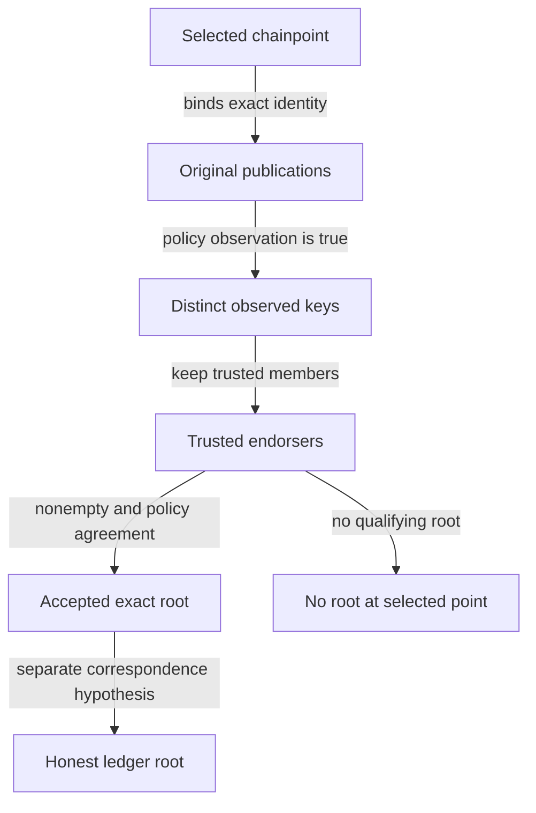

# Inspect root acceptance

As a design reviewer, run a terminal's root choice against trusted and untrusted publications. An honest scenario returns the accepted root and selected chainpoint. A publication from an untrusted key returns `no-root` at that same point, even when signature validity is assumed. Removing the trusted-set check demonstrates why that refusal matters.

This is an executable project model and simulator. Component implementations, cryptography, deployment and live-chain behavior require separate evidence. Review the model and this page from the same Git revision.

## Run the scenarios

From the repository root, with Nix flakes enabled:

```bash
./lean/env lake build
./lean/env lake exe lockness-sim accept-root honest
./lean/env lake exe lockness-sim accept-root untrusted-key
./lean/env lake exe lockness-sim accept-root subset-mutation
./tools/check-model.sh
./tools/check-docs.sh
just ci
```

`lean/env` enters the `lean/` directory with revision-pinned Lean 4.29.0 and its C compiler, and rejects a different Lean version. For an interactive pinned environment, run `./lean/env bash`; there the commands are `lake build` and `lake exe lockness-sim accept-root <scenario>`. The [toolchain file](https://github.com/lambdasistemi/lockness/blob/main/lean/lean-toolchain) also supports standard Elan workflows. The library uses core and Std, with no mathlib or external Lake packages.

| Scenario | Observable result |
| --- | --- |
| Honest publications | `accepted-root`, full selected point, exact root scheme and bytes, two distinct endorsers despite a duplicate publication |
| Untrusted key | `no-root`, full selected point, signature validity explicitly labelled an abstract assumption |
| Removed trusted-set check | Production refuses; the mutation accepts the untrusted root and has a compiled refutation of the unchanged safety statement |

An unexpected scenario outcome exits nonzero. Unknown scenario names exit with a usage failure. These are executable model observations, without a network, ledger provider or signature implementation.

## Follow the acceptance boundary



The terminal supplies its policy and selected point. For each proposed root, `acceptRoot` finds publications at the exact network, slot and block hash, with that root's exact scheme and bytes. It passes the original publication, including unchanged signature and message sequences, to an arbitrary Boolean observation supplied by the policy. It deduplicates keys, keeps trusted members, and accepts the first root whose nonempty distinct endorsement satisfies the supplied agreement. Untrusted publications cannot manufacture agreement or prevent qualifying trusted publications from being considered.

```lean
acceptRoot : Policy → List Publication → Chainpoint → Except Refusal Root
```

The [acceptance definition](https://github.com/lambdasistemi/lockness/blob/main/lean/Lockness/Root.lean) returns `noRoot selectedPoint` when no proposal qualifies. The shared refusal type has exactly three constructors: `noRoot`, `unavailablePoint` and `evidenceFailure`, each carrying the selected point. This function only emits `noRoot`; the other refusals belong to later behavior.

| Design choice | Alternative | Reason |
| --- | --- | --- |
| Policy supplies arbitrary executable observations | Compute an arbitrary validity proposition | Arbitrary propositions are not generally executable; signature soundness stays an explicit hypothesis |
| Distinct keys endorse the exact point and root | Count publication copies | Repeated messages cannot invent independent endorsement |
| Filter trusted members before agreement | Let irrelevant untrusted publications prevent acceptance | Trust belongs to the terminal's selected policy |
| Require nonempty endorsement | Let a permissive agreement accept no evidence | Agreement alone cannot authorize an empty set |
| Separate honest-root correspondence | Infer ledger correctness from signatures and agreement | Trusted publishers can endorse a wrong ledger root |

## Read the model contracts

The [shared types](https://github.com/lambdasistemi/lockness/blob/main/lean/Lockness/Types.lean) preserve exact byte sequences. Network and root scheme are explicit byte identities, slot is a natural number, and every equality includes all fields. There is no normalization, serialization, hashing or signing algorithm.

| Surface | Contract in this slice |
| --- | --- |
| `Bytes`, `Chainpoint`, `Root`, `Publication` | Original byte sequences, exact point/root identities and original message/signature evidence |
| `Policy` | Trusted keys, agreement on distinct keys and arbitrary publication observations |
| `Refusal` | Exactly the three selected-point refusals |
| `Session` | Selected point and accepted root; no lifecycle behavior |
| `LedgerAnswer` | Point, exact ledger object and witness bytes; no verification behavior |
| `AppAnswer` | Application identity, context, point, root, claim, exact value and proof; no application verification behavior |

`SigValid publication` is an uncomputed proposition supplied by an implicit, arbitrary `SignatureModel`. The project defines no global instance fixing validity. `ObservationSound policy` explicitly assumes that a true observation implies this predicate. Neither an observation nor the model simulator implements signature verification. Signature encodings, key rotation and cryptographic correctness remain external contracts.

The [general proofs](https://github.com/lambdasistemi/lockness/blob/main/lean/Lockness/RootProofs.lean) state their guarantees over arbitrary policies, publications and selected points:

| Declaration | Established model guarantee |
| --- | --- |
| `acceptRoot_safe` | Successful acceptance has nonempty distinct trusted endorsers satisfying agreement, with original publication witnesses at the exact point and root |
| `acceptRoot_valid` | The same witnesses have abstract signature validity under the explicit observation-soundness hypothesis |
| `acceptRoot_refusal` | Any refusal from this function is exactly `noRoot` at the selected point |
| `acceptRoot_honest` | Accepted root equals the downstream honest root only under separate `HonestRootCorrespondence` |

The [counterexamples](https://github.com/lambdasistemi/lockness/blob/main/lean/Lockness/Counterexamples/SubsetMutation.lean) give an inhabited abstract validity hypothesis for an untrusted publication, prove its refusal, constructively refute safety after removing trusted-set checking, and show that endorsement alone does not establish an honest ledger root.

## Assess the evidence

`check-model` builds every model module, inventories every stored theorem including private proofs, and reports its axiom dependencies. It permits only Lean's standard `propext`, `Classical.choice` and `Quot.sound`; holes and custom escape axioms fail. Lean checks anonymous examples during compilation but does not retain them in the declaration inventory: strict compiler warnings and a source hole policy reject their holes. Deliberate named and anonymous `sorry`, `admit` and unused custom-axiom controls must reach the relevant rejection, rather than fail because a tool or import is missing.

The gate executes all three scenarios and compiles the subset counterexample. In temporary build directories it removes the production trust filter, compiles the mutated definition, proves the unchanged universal safety statement false, and separately retains the failed unchanged proof output. It also checks compiled changed outcomes and proof rejection for observation, point/root binding, nonempty endorsement, agreement and refusal-point faults. The untrusted-key simulator must reject the unexpected result of the production subset mutation. This is a finite collection of negative controls, not a claim of exhaustive mutation coverage.

Run `./lean/env lake env lean Lockness/Counterexamples/SubsetMutation.lean` to inspect the constructive counterexample independently. Record `git rev-parse HEAD` alongside command output when assessing a candidate. CI invokes the same model and documentation commands; the source workflow alone is not evidence that remote CI has passed.

| Evidence layer | Limit |
| --- | --- |
| Design | Records the project trust boundary and open contracts |
| Model and simulator | Kernel-checked properties of this root acceptance model and concrete executable paths |
| Documentation checks | Presentation, speech freshness and strict site construction |
| Independent acceptance and remote CI | Require revision-bound review and actual successful workflow results |
| Component implementation, deployment and live chain | Not established by this model |

The Lean kernel remains part of the trust base. Observation soundness and honest-root correspondence are external assumptions. The executable guard and statement share the definition of a qualifying candidate; the mutation checks preserve that statement while altering execution, and do not independently prove specification fidelity. Sessions, witnesses, application proofs, effects, canonicality, freshness and settlement are later work. Consume model and documentation by reviewed revision; a tagged binary distribution pipeline remains future implementation work.

Continue to [design decisions and remaining guarantees](../design/decisions.md) and the [project architecture](../architecture/system.md).
